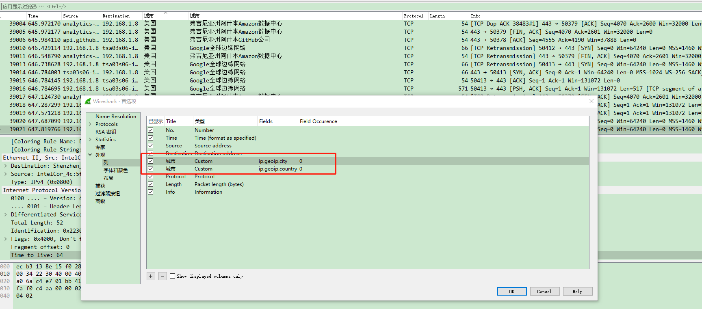

# 综合

# Awesomes

1. [https://github.com/jobbole/awesome-go-cn](https://github.com/jobbole/awesome-go-cn)
2. 后端架构师技术图谱
   [https://github.com/xingshaocheng/architect-awesome/](https://github.com/xingshaocheng/architect-awesome/)
3. Build your own (insert technology here) 创造自己的系统（各种各样的）
   [https://github.com/mengyou658/build-your-own-x](https://github.com/mengyou658/build-your-own-x)
4. [https://github.com/sorrycc/awesome-javascript](https://github.com/sorrycc/awesome-javascript)
5. [https://github.com/vuejs/awesome-vue](https://github.com/vuejs/awesome-vue)
6. [https://github.com/mengyou658/awesome-coins](https://github.com/mengyou658/awesome-coins)
7. [https://github.com/mengyou658/awesome](https://github.com/mengyou658/awesome)
8. [https://github.com/Jokeren/Awesome-GPU](https://github.com/Jokeren/Awesome-GPU)
9. [https://github.com/josephmisiti/awesome-machine-learning](https://github.com/josephmisiti/awesome-machine-learning)
10. [https://github.com/Erkaman/Awesome-CUDA](https://github.com/Erkaman/Awesome-CUDA)
11. [https://github.com/fffaraz/awesome-cpp](https://github.com/fffaraz/awesome-cpp)
12. [https://github.com/rust-unofficial/awesome-rust](https://github.com/rust-unofficial/awesome-rust)
13. [https://github.com/avelino/awesome-racket](https://github.com/avelino/awesome-racket)
14. [https://github.com/aleksandar-todorovic/awesome-linux](https://github.com/aleksandar-todorovic/awesome-linux)
15. [https://github.com/akullpp/awesome-java](https://github.com/akullpp/awesome-java)
16. [https://github.com/krispo/awesome-haskell](https://github.com/krispo/awesome-haskell)
17. [https://github.com/uhub/awesome-coq](https://github.com/uhub/awesome-coq)
18. [https://github.com/enaqx/awesome-react](https://github.com/enaqx/awesome-react)
19. [https://github.com/prakhar1989/awesome-courses](https://github.com/prakhar1989/awesome-courses)
20. [https://github.com/vuejs/awesome-vue](https://github.com/vuejs/awesome-vue)
21. [https://github.com/alebcay/awesome-shell](https://github.com/alebcay/awesome-shell)
22. [https://github.com/xgrommx/awesome-redux](https://github.com/xgrommx/awesome-redux)
23. [https://github.com/KotlinBy/awesome-kotlin](https://github.com/KotlinBy/awesome-kotlin)
24. [https://github.com/jondot/awesome-react-native](https://github.com/jondot/awesome-react-native)
25. [https://github.com/dhamaniasad/awesome-postgres](https://github.com/dhamaniasad/awesome-postgres)
26. [https://github.com/m4ll0k/Awesome-Hacking-Tools](https://github.com/m4ll0k/Awesome-Hacking-Tools)
27. [https://github.com/jekil/awesome-hacking](https://github.com/jekil/awesome-hacking)
28. [https://github.com/sdogruyol/awesome-ruby](https://github.com/sdogruyol/awesome-ruby)
29. [https://github.com/vinta/awesome-python](https://github.com/vinta/awesome-python)
30. [https://github.com/quozd/awesome-dotnet](https://github.com/quozd/awesome-dotnet)
31. [https://github.com/sindresorhus/awesome-npm](https://github.com/sindresorhus/awesome-npm)
32. [https://github.com/JStumpp/awesome-android](https://github.com/JStumpp/awesome-android)
33. [https://github.com/humiaozuzu/awesome-flask](https://github.com/humiaozuzu/awesome-flask)
34. [https://github.com/rossant/awesome-math](https://github.com/rossant/awesome-math)
35. [https://github.com/PatrickJS/awesome-angular](https://github.com/PatrickJS/awesome-angular)
36. [https://github.com/vinjn/awesome-vulkan](https://github.com/vinjn/awesome-vulkan)
37. [https://github.com/qinwf/awesome-R](https://github.com/qinwf/awesome-R)
38. [https://github.com/ramitsurana/awesome-kubernetes](https://github.com/ramitsurana/awesome-kubernetes)
39. [https://github.com/vsouza/awesome-ios](https://github.com/vsouza/awesome-ios)
40. [https://github.com/ziadoz/awesome-php](https://github.com/ziadoz/awesome-php)
41. [https://github.com/deephacks/awesome-jvm](https://github.com/deephacks/awesome-jvm)
42. [https://github.com/sorrycc/awesome-javascript](https://github.com/sorrycc/awesome-javascript)
43. [https://github.com/ChristosChristofidis/awesome-deep-learning](https://github.com/ChristosChristofidis/awesome-deep-learning)
44. [https://github.com/Solido/awesome-flutter](https://github.com/Solido/awesome-flutter)
45. 🇨🇳 GitHub中文排行榜，帮助你发现高分优秀中文项目、更高效地吸收国人的优秀经验成果；榜单每周更新一次，敬请关注！（武汉加油！中国加油！世界加油！）
    [https://github.com/kon9chunkit/GitHub-Chinese-Top-Charts](https://github.com/kon9chunkit/GitHub-Chinese-Top-Charts)
46. [https://github.com/knownsec/404StarLink](https://github.com/knownsec/404StarLink)

### 面试

1. 【互联网一线大厂面试+学习指南】
   [https://github.com/AobingJava/JavaFamily](https://github.com/AobingJava/JavaFamily)
1. 前端面试每日 3+1，以面试题来驱动学习，提倡每日学习与思考，每天进步一点
   [https://github.com/haizlin/fe-interview](https://github.com/haizlin/fe-interview)
1. Java面试
   [https://github.com/CyC2018/CS-Notes](https://github.com/CyC2018/CS-Notes)
1. Android面试复习
   [https://github.com/huannan/AndroidReview](https://github.com/huannan/AndroidReview)
1. Java面试通关手册（Java学习指南）Java Interview Customs Manual (Java Study Guide)
   [https://github.com/Snailclimb/Java-Guide](https://github.com/Snailclimb/Java-Guide)
   [https://github.com/Snailclimb/JavaGuide](https://github.com/Snailclimb/JavaGuide)
1. 系统设计 学习如何设计大型系统 为系统设计的面试做准备
   [https://github.com/donnemartin/system-design-primer](https://github.com/donnemartin/system-design-primer)
1. 面试图谱
   [https://github.com/KieSun/InterviewMap](https://github.com/KieSun/InterviewMap)
1. 面试 java
   [https://github.com/kdn251/interviews/blob/master/README-zh-cn.md](https://github.com/kdn251/interviews/blob/master/README-zh-cn.md)
1. java 面试
   [https://github.com/crossoverJie/Java-Interview](https://github.com/crossoverJie/Java-Interview)
1. 基于项目的学习教程
   [https://github.com/mengyou658/project-based-learning](https://github.com/mengyou658/project-based-learning)
1. 后端架构师技术图谱
   [https://github.com/xingshaocheng/architect-awesome](https://github.com/xingshaocheng/architect-awesome)
1. Google 面试自学手册
   [https://github.com/jwasham/coding-interview-university/blob/master/translations/README-cn.md](https://github.com/jwasham/coding-interview-university/blob/master/translations/README-cn.md)
1. 最新的面试笔记
   [https://github.com/CyC2018/Interview-Notebook](https://github.com/CyC2018/Interview-Notebook)
1. 最新的面试笔记
   [https://github.com/mengyou658/InterviewNotes](https://github.com/mengyou658/InterviewNotes)
1. Java面试相关
   [https://github.com/mengyou658/interviews](https://github.com/mengyou658/interviews)
1. 面试
   [https://github.com/kdn251/interviews](https://github.com/kdn251/interviews)
1. 创建cv（创建个人简历）
   [https://github.com/mengyou658/best-resume-ever](https://github.com/mengyou658/best-resume-ever)
1. node-js 面试
   [https://github.com/mengyou658/node-interview](https://github.com/mengyou658/node-interview)
1. 安卓面试
   [https://github.com/mengyou658/android_interview](https://github.com/mengyou658/android_interview)
1. 代码面试
   [https://github.com/mengyou658/coding-interview-university](https://github.com/mengyou658/coding-interview-university)
1. 面试问题集合
   [https://github.com/fejes713/30-seconds-of-interviews](https://github.com/fejes713/30-seconds-of-interviews)
1. 技术面试最后反问面试官的话
   [https://github.com/yifeikong/reverse-interview-zh](https://github.com/yifeikong/reverse-interview-zh)
1. [在线教育https://github.com/EbookFoundation/free-programming-books/blob/master/books/free-programming-books-zh.md](https://github.com/EbookFoundation/free-programming-books/blob/master/books/free-programming-books-zh.md)

### 深入研究

1. 系统设计 学习如何设计大型系统 为系统设计的面试做准备
   [https://github.com/donnemartin/system-design-primer](https://github.com/donnemartin/system-design-primer)
1. Writing a sqlite clone from scratch in C （教你怎么样写一个数据库）
   [https://github.com/cstack/db_tutorial](https://github.com/cstack/db_tutorial)
1. 规范
   [https://github.com/wearehive/project-guidelines/blob/master/README-zh.md](https://github.com/wearehive/project-guidelines/blob/master/README-zh.md)
1. Web Security Learning (web安全)
   [https://github.com/mengyou658/Web-Security-Learning](https://github.com/mengyou658/Web-Security-Learning)
1. A collective list of public JSON APIs for use in web development.
   [https://github.com/mengyou658/public-apis-1](https://github.com/mengyou658/public-apis-1)
1. API Gateway & Microservice Management（nginx插件，api防火墙和服务治理）
   [https://github.com/Mashape/kong](https://github.com/Mashape/kong)
1. spark相关笔记
   [https://github.com/ColZer/DigAndBuried/](https://github.com/ColZer/DigAndBuried/)
1. 学习教程
   [https://github.com/clone95/Virgilio/blob/master/zh-CN/README.md](https://github.com/clone95/Virgilio/blob/master/zh-CN/README.md)
1. 2019年最新总结，从程序员到CTO，从专业走向卓越，分享大牛企业内部pdf与PPT
   [https://github.com/0voice/from_coder_to_expert](https://github.com/0voice/from_coder_to_expert)
1. readme 模板 Various README templates & tips on writing high-quality documentation that people want to read
   [https://github.com/kylelobo/The-Documentation-Compendium](https://github.com/kylelobo/The-Documentation-Compendium)
1. 每个软件开发人员应该知道的（大多数）技术事项的集合 A collection of (mostly) technical things every software developer should know
   [https://github.com/mtdvio/every-programmer-should-know](https://github.com/mtdvio/every-programmer-should-know)
1. python3写的综合扫描工具，主要用来敏感文件探测(目录扫描与js泄露接口)
   ，WAF/CDN识别，端口扫描，指纹/服务识别，操作系统识别，弱口令探测，POC扫描，SQL注入，绕过CDN，查询旁站等功能，主要用来甲方自测或乙方授权测试，请勿用来搞破坏
   [https://github.com/al0ne/Vxscan](https://github.com/al0ne/Vxscan)

# 课程教程视频文档下载

1. 国内大学教学课程下载
   [https://github.com/lib-pku/libpku](https://github.com/lib-pku/libpku)

### 3D

1. Large Pose 3D Face Reconstruction from a Single Image via Direct Volumetric CNN Regression (
   将人像图片，转换成3D面部，将一个图片转换出3D面部)
   [https://github.com/mengyou658/vrn](https://github.com/mengyou658/vrn)

### 效率相关

1. mac os 工具应用列表
   [https://github.com/nikitavoloboev/my-mac-os](https://github.com/nikitavoloboev/my-mac-os)

### 教程/文章/规范

1. java 知识
   [https://github.com/crossoverJie/JCSprout](https://github.com/crossoverJie/JCSprout)
1. css 教程
   [https://github.com/mengyou658/css-protips](https://github.com/mengyou658/css-protips)
1. 清单
   [https://github.com/mengyou658/Web-Development-And-Engineering-Practices](https://github.com/mengyou658/Web-Development-And-Engineering-Practices)
1. Coder-Knowledge-Management 程序员的知识管理：技术视野与职业规划
   [https://github.com/wxyyxc1992/Coder-Knowledge-Management](https://github.com/wxyyxc1992/Coder-Knowledge-Management)
1. 书籍列表
   [https://github.com/mengyou658/free-programming-books-zh_CN](https://github.com/mengyou658/free-programming-books-zh_CN)
1. 书籍列表2
   [https://github.com/mengyou658/awesome-programming-books](https://github.com/mengyou658/awesome-programming-books)
1. 书籍列表3
   [https://github.com/mengyou658/books](https://github.com/mengyou658/books)
1. Node.js 实践教程
   [https://github.com/ElemeFE/node-practice](https://github.com/ElemeFE/node-practice)
1. you don't know js (js进阶教程)
   [https://github.com/getify/You-Dont-Know-JS](https://github.com/getify/You-Dont-Know-JS)
1. A collection of (mostly) technical things every software developer should know （技术问题得收集）
   [https://github.com/mengyou658/every-programmer-should-know](https://github.com/mengyou658/every-programmer-should-know)
1. Modern JavaScript Tutorial （javascript 教程）
   [https://github.com/iliakan/javascript-tutorial-en](https://github.com/iliakan/javascript-tutorial-en)
1. 移动前端开发收藏夹
   [https://github.com/hoosin/mobile-web-favorites](https://github.com/hoosin/mobile-web-favorites)
1. 腾讯移动Web前端知识库
   [https://github.com/mengyou658/Mars-1](https://github.com/mengyou658/Mars-1)
1. 列表
   [https://github.com/mengyou658/awesome](https://github.com/mengyou658/awesome)

###### # 规范

1. 阿里云java代码规范
   [https://github.com/alibaba/p3c](https://github.com/alibaba/p3c)

### 人工智能 / 机器学习

1. TensorFlow Tutorial and Examples for beginners （TensorFlow 入门）
   [https://github.com/aymericdamien/TensorFlow-Examples](https://github.com/aymericdamien/TensorFlow-Examples)
1. Style transfer, deep learning, feature transform （图片的样式材质转换，使用机器学习 NVIDIA ）
   [https://github.com/mengyou658/FastPhotoStyle](https://github.com/mengyou658/FastPhotoStyle)
1. TensorFlow 官方文档中文版 V1.7
   [https://github.com/mengyou658/tensorflow-docs](https://github.com/mengyou658/tensorflow-docs)

### coding style（代码风格规范）

* [https://github.com/google/styleguide](https://github.com/google/styleguide)

### The Gambler's Fallacy Dice 赌徒谬误的一个实现

* [https://github.com/xori/gamblers-dice](https://github.com/xori/gamblers-dice)

### 黑客相关

1. wifi漏洞
   [https://github.com/kristate/krackinfo](https://github.com/kristate/krackinfo)
1. [环境搭建，POC，漏洞原理全部集合在一个文库http://wiki.peiqi.tech/](http://wiki.peiqi.tech/)

# cheatsheet 备忘录 速查表

[https://github.com/mengyou658/cheatsheets](https://github.com/mengyou658/cheatsheets)
[https://github.com/mengyou658/awesome-cheatsheets](https://github.com/mengyou658/awesome-cheatsheets)

# An instant JSON API for your SQLite databases (将 sqlite 数据暴露成一个只读的json-api)

[https://github.com/mengyou658/datasette](https://github.com/mengyou658/datasette)

# Secure Socket Funneling - Network tool and toolkit - TCP and UDP port forwarding, SOCKS proxy, remote shell, standalone and cross platform 类似Shadowsocks的工具跨平台

[https://github.com/mengyou658/ssf](https://github.com/mengyou658/ssf)
[https://github.com/Dreamacro/clash/tree/master](https://github.com/Dreamacro/clash/tree/master)

1. 科学上网 相关文章
   [https://github.com/haoel/haoel.github.io](https://github.com/haoel/haoel.github.io)
1. 访问google 谷歌 插件
   [https://github.com/haotian-wang/google-access-helper](https://github.com/haotian-wang/google-access-helper)

# 英文字体，适合排版，写作用的字体 IBM 出品

[https://github.com/mengyou658/iA-Fonts](https://github.com/mengyou658/iA-Fonts)

# svg icon

[https://github.com/mengyou658/SuperTinyIcons](https://github.com/mengyou658/SuperTinyIcons)

# 开源项目怎么挣钱

[https://github.com/mengyou658/lemonade-stand](https://github.com/mengyou658/lemonade-stand)

# 浏览器

1. nEXT is the fastest productivity browser. It is designed from the ground up to be customizable for your workflow.
   nEXT Browser is the infinitely EXTensible browser. 自带快捷，快捷提示的浏览器
   [https://github.com/mengyou658/nEXT](https://github.com/mengyou658/nEXT)
1. A fully implemented kernel exploit for the PS4 on 4.05FW PS4系统内核漏洞
   [https://github.com/mengyou658/PS4-4.05-Kernel-Exploit](https://github.com/mengyou658/PS4-4.05-Kernel-Exploit)
1. A fully interactive, realtime and modern text-based browser rendered to TTYs and browsers
   [https://github.com/browsh-org/browsh](https://github.com/browsh-org/browsh)

# 游戏

1. 3D using bitblting in Windows. 使用windows的接口开发游戏
   [https://github.com/mengyou658/3D-Game-Programming](https://github.com/mengyou658/3D-Game-Programming)
1. bs framework：新一代 C++ 游戏开发框架 bs :: framework 是一个新一代的 C ++ 游戏开发框架，专注于现代技术、高质量设计和高性能，旨在为开发实时图形应用程序（游戏、引擎或工具）提供统一的基础。
   [https://www.bsframework.io/](https://www.bsframework.io/)
1. 复古游戏开发工具，拖拽形式 视觉复古游戏制造商
   [https://github.com/chrismaltby/gb-studio](https://github.com/chrismaltby/gb-studio)
1. 开源的飞行模拟器
   http://home.flightgear.org/
1. 开源游戏的列表
   [https://osgameclones.com/](https://osgameclones.com/)

# 开发语言 luna (Visual and textual functional programming language with a focus on productivity, collaboration and development ergonomics. 基于图形方式变成的语言，视觉和文字功能性编程语言，重点是生产力，协作和开发人体工程学)

[https://github.com/mengyou658/luna](https://github.com/mengyou658/luna)

# 黑苹果 Hackintosh 安装

[https://github.com/huangyz0918/Hackintosh-Installer-University](https://github.com/huangyz0918/Hackintosh-Installer-University)

# 工具

[1. 一个功能强大的开源的视频编辑器
[https://kdenlive.org](https://kdenlive.org)

1. win10激活工具
   [https://github.com/mengyou658/CMWTAT_Digital_Edition](https://github.com/mengyou658/CMWTAT_Digital_Edition)
1. windows 破解密码工具 Crack any Microsoft Windows users password without any privilege
   [https://github.com/DarkCoderSc/win-brute-logon](https://github.com/DarkCoderSc/win-brute-logon)
1. 为 Wireshark 能使用纯真网络 IP 数据库(QQwry)而提供的格式转换工具
   [https://github.com/leolovenet/qqwry2mmdb](https://github.com/leolovenet/qqwry2mmdb)
   
1. [https://github.com/ventoy/Ventoy Ventoy是一个制作可启动U盘的开源工具。有了Ventoy你就无需反复地格式化U盘，你只需要把ISO/WIM/IMG/EFI文件拷贝到U盘里面就可以启动了，无需其他操作。 你可以一次性拷贝很多个不同类型的ISO文件，在启动时Ventoy会显示一个菜单来选择(截图)。 无差异支持Legacy BIOS和UEFI模式。目前已经测试了各类超过470+ 个ISO文件(列表). 同时提出了"Ventoy Compatible"的概念，若被支持则理论上可以启动任何ISO文件.](https://github.com/ventoy/Ventoy)](
   1. 一个功能强大的开源的视频编辑器
   [https://kdenlive.org](https://kdenlive.org)
1. win10激活工具
   [https://github.com/mengyou658/CMWTAT_Digital_Edition](https://github.com/mengyou658/CMWTAT_Digital_Edition)
1. windows 破解密码工具 Crack any Microsoft Windows users password without any privilege
   [https://github.com/DarkCoderSc/win-brute-logon](https://github.com/DarkCoderSc/win-brute-logon)
1. 为 Wireshark 能使用纯真网络 IP 数据库(QQwry)而提供的格式转换工具
   [https://github.com/leolovenet/qqwry2mmdb](https://github.com/leolovenet/qqwry2mmdb)
   
1. [https://github.com/ventoy/Ventoy Ventoy是一个制作可启动U盘的开源工具。有了Ventoy你就无需反复地格式化U盘，你只需要把ISO/WIM/IMG/EFI文件拷贝到U盘里面就可以启动了，无需其他操作。 你可以一次性拷贝很多个不同类型的ISO文件，在启动时Ventoy会显示一个菜单来选择(截图)。 无差异支持Legacy BIOS和UEFI模式。目前已经测试了各类超过470+ 个ISO文件(列表). 同时提出了"Ventoy Compatible"的概念，若被支持则理论上可以启动任何ISO文件.](https://github.com/ventoy/Ventoy)
   )

# 1000多万中国大陆工商企业的注册信息库（下附链接）

[https://github.com/imhuster/Enterprise-Registration-Data-of-Chinese-Mainland](https://github.com/imhuster/Enterprise-Registration-Data-of-Chinese-Mainland)

# 定时任务生成器 html版本 页面版本 js版本

1. [https://github.com/mengyou658/cronGen](https://github.com/mengyou658/cronGen)
1. [https://github.com/mengyou658/cron-expression-generator](https://github.com/mengyou658/cron-expression-generator)
1. [https://github.com/jingtingzhiwu/CronExpressGenetor](https://github.com/jingtingzhiwu/CronExpressGenetor)
1. http://cron.qqe2.com/ 在线工具
1. [https://github.com/arnapou/jqcron](https://github.com/arnapou/jqcron)

# git

1. git 问题集锦
   [https://github.com/k88hudson/git-flight-rules/blob/master/README_zh-CN.md](https://github.com/k88hudson/git-flight-rules/blob/master/README_zh-CN.md)

# 收集免费的接口服务,做一个api的搬运工

[https://github.com/fangzesheng/free-api](https://github.com/fangzesheng/free-api)

# 函数式编程术语

[https://github.com/shfshanyue/fp-jargon-zh](https://github.com/shfshanyue/fp-jargon-zh)

# 解决电脑、手机看电视直播的苦恼，收集各种直播源，电视直播网站

[https://github.com/biancangming/wtv/](https://github.com/biancangming/wtv/)
[https://github.com/billy21/Tvlist-awesome-m3u-m3u8](https://github.com/billy21/Tvlist-awesome-m3u-m3u8)
[https://github.com/EvilCult/iptv-m3u-maker](https://github.com/EvilCult/iptv-m3u-maker)

# 该仓库专门收集泄漏保密信息的谷歌搜素命令，比如搜索泄漏的数据库导出文件，就在谷歌输入"#mysql dump" filetype:sql

[https://github.com/BullsEye0/google_dork_list](https://github.com/BullsEye0/google_dork_list)

# 科学上网

1. [https://github.com/qingshuisiyuan/electron-ssr-backup](https://github.com/qingshuisiyuan/electron-ssr-backup)
1. [https://github.com/geph-official/geph2](https://github.com/geph-official/geph2)
1. [https://github.com/googlehosts/hosts/wiki/%E5%AE%9E%E9%AA%8C%E5%AE%A4#shadowsocks](https://github.com/googlehosts/hosts/wiki/%E5%AE%9E%E9%AA%8C%E5%AE%A4#shadowsocks)
   1, [https://github.com/the0demiurge/ShadowSocksShare](https://github.com/the0demiurge/ShadowSocksShare)
1. [https://github.com/Alvin9999/new-pac/wiki](https://github.com/Alvin9999/new-pac/wiki)
1. [https://github.com/Jrohy/trojan](https://github.com/Jrohy/trojan)
1. [https://github.com/hq450/fancyss](https://github.com/hq450/fancyss)

# 耿爽模拟器，用于模仿中国外交部发言人耿爽的言论

[https://github.com/xwgmdjc/GengShuang](https://github.com/xwgmdjc/GengShuang)

# Unlock encrypted music file in browser. 在浏览器中解锁加密的音乐文件。

[https://github.com/ix64/unlock-music](https://github.com/ix64/unlock-music)

# 文言文 编程语言

[https://github.com/LingDong-/wenyan-lang](https://github.com/LingDong-/wenyan-lang)

# 磁力搜索

[https://github.com/xiandanin/magnetW](https://github.com/xiandanin/magnetW)
Motrix 是一款全能的下载工具，支持下载 HTTP、FTP、BT、磁力链、百度网盘等资源
[https://github.com/agalwood/Motrix](https://github.com/agalwood/Motrix)

# 免费图片 视频 免版权 资源

[https://github.com/neutraltone/awesome-stock-resources](https://github.com/neutraltone/awesome-stock-resources)

# surge 脚本

[https://github.com/mengyou658/surge](https://github.com/mengyou658/surge)
删除微博广告 显示影视评分 显示京东价格历史 淘宝价格历史

# chromium源码阅读

[https://www.cnblogs.com/danxi/p/7020375.html](https://www.cnblogs.com/danxi/p/7020375.html)

# GG大玩家游戏

[https://github.com/lavendnigth/mod.git](https://github.com/lavendnigth/mod.git)

#### ui 设计 资源

[https://nodesign.dev/](https://nodesign.dev/)

# 分页查询不要使用 OFFSET 和 LIMIT 语法

```mysql
-- 老方法
select * from t_table limit 10 offset 200000;
-- 新方法 记录上一次查询的id（主键）
select * from t_table where id > 199999 limit 10 ;

```

# 微积分

1. 微积分中文版本
   [https://github.com/apachecn/calc4b-zh](https://github.com/apachecn/calc4b-zh)
1. 微积分英文版本翻译
   [https://www.geogebra.org/m/x39ys4d7#material/phuyhqtw](https://www.geogebra.org/m/x39ys4d7#material/phuyhqtw)

# 大公司团队开源项目

[https://github.com/niezhiyang/open_source_team](https://github.com/niezhiyang/open_source_team)

# api security (API设计列表)

1. https://github.com/shieldfy/API-Security-Checklist
