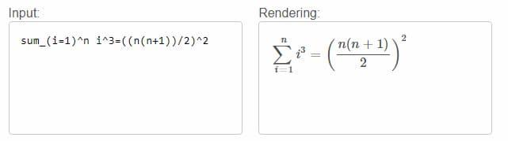
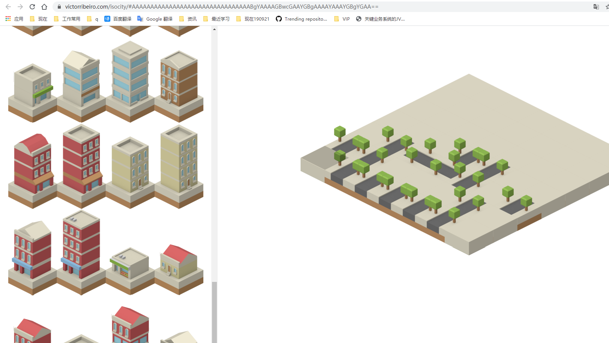

# javascript

### 现成列表

1. [https://github.com/sindresorhus/awesome-electron](https://github.com/sindresorhus/awesome-electron)
1.

### 性能研究

1. Zero是一款小型图形应用程序，它使用JavaScript复制GPU的功能，并使用终端通过nodejs的stdout显示其渲染的输出。零是为了娱乐而写的，也是为了看一个人能在多大程度上提高JavaScript性能

* 可编程的顶点和片段着色器（在JavaScript中）
* 透视图Z正确纹理映射
* 每像素深度缓冲
* 终端调整大小时的自适应分辨率（仅TTY）
* 矩阵和向量数学库。
* 场景图
  [https://github.com/sinclairzx81/zero](https://github.com/sinclairzx81/zero)

1.

### 教程/文章/小抄/规范/记事

1. 你不知道的JavaScript 中文部分 js深入解析
   [https://github.com/yygmind/Reading-Notes/blob/master/%E4%BD%A0%E4%B8%8D%E7%9F%A5%E9%81%93%E7%9A%84JavaScript%E4%B8%8A%E5%8D%B7.md](https://github.com/yygmind/Reading-Notes/blob/master/%E4%BD%A0%E4%B8%8D%E7%9F%A5%E9%81%93%E7%9A%84JavaScript%E4%B8%8A%E5%8D%B7.md)
1. 前端深入阅读源码 包括 vue vuex 等
   [https://github.com/frontend9/fe9-library](https://github.com/frontend9/fe9-library)
1. CSS Inspiration，在这里找到写 CSS 的灵感！
   [https://github.com/chokcoco/CSS-Inspiration](https://github.com/chokcoco/CSS-Inspiration)
1. 一些css常用样式
   [https://github.com/QiShaoXuan/css_tricks](https://github.com/QiShaoXuan/css_tricks)
1. JavaScript开发者应懂的33个概念  
   [https://github.com/stephentian/33-js-concepts](https://github.com/stephentian/33-js-concepts)
1. 清单
   [https://github.com/mengyou658/Web-Development-And-Engineering-Practices](https://github.com/mengyou658/Web-Development-And-Engineering-Practices)
1. you don't know js (js进阶教程)
   [https://github.com/getify/You-Dont-Know-JS](https://github.com/getify/You-Dont-Know-JS)
1. A list of funny and tricky JavaScript examples (js有意思的代码片段)
   [https://github.com/denysdovhan/wtfjs](https://github.com/denysdovhan/wtfjs)
1. JavaScript Style Guide
   [https://github.com/airbnb/javascript](https://github.com/airbnb/javascript)
    ```js
    // .eslintrc file
    // Use this file as a starting point for your project's .eslintrc.
    // Copy this file, and add rule overrides as needed.
    {
      "extends": "airbnb"
    }
    ```
1. A collection of (mostly) technical things every software developer should know （技术问题得收集）
   [https://github.com/mengyou658/every-programmer-should-know](https://github.com/mengyou658/every-programmer-should-know)
1. Modern JavaScript Tutorial （javascript 教程）
   [https://github.com/iliakan/javascript-tutorial-en](https://github.com/iliakan/javascript-tutorial-en)
1. js 小抄
   [https://github.com/mbeaudru/modern-js-cheatsheet# notions](https://github.com/mbeaudru/modern-js-cheatsheet#
   notions)
1. js 代码 片段 code
   [https://github.com/mengyou658/30-seconds-of-code](https://github.com/mengyou658/30-seconds-of-code)
1. 前端面试题和答案
   [https://github.com/Advanced-Frontend/Daily-Interview-Question](https://github.com/Advanced-Frontend/Daily-Interview-Question)
1. JavaScript是如何工作的系列 前端性能优化 JavaScript 数据结构
   [https://github.com/qq449245884/xiaozhi](https://github.com/qq449245884/xiaozhi)
1.

### 实用 库/模块/框架

1. [lodash包含比较全面的工具类](https://www.lodashjs.com/)
2. [ramda一款实用的 JavaScript 函数式编程库](https://ramda.cn/)
3. es6 proxy polyfill
   [https://github.com/GoogleChrome/proxy-polyfill](https://github.com/GoogleChrome/proxy-polyfill)
4. Comlink 开发 WebWorkers 简单
   [https://github.com/GoogleChromeLabs/comlink](https://github.com/GoogleChromeLabs/comlink)
5. JavaScript math library
   [https://github.com/josdejong/mathjs](https://github.com/josdejong/mathjs)
6. search JavaScript （js中搜索）
   [https://github.com/KingPixil/wade](https://github.com/KingPixil/wade)
7. js 模糊搜索
   [https://github.com/mengyou658/Fuse](https://github.com/mengyou658/Fuse)
8. 全文检索 Next-Generation full text search library for Browser and Node.js
   [https://github.com/nextapps-de/flexsearch](https://github.com/nextapps-de/flexsearch)
9. 苦于没有找到一个比较合适的敏感词过滤库，所以我自己花了点时间撸了一个。 它基于广为人知的 ahocorasick 字符串匹配算法，使用原生的 js 实现，浏览器和服务端都可以使用
   [https://github.com/pyloque/fastscan](https://github.com/pyloque/fastscan)
10. 富文本编辑器 替代ueditor
    [https://github.com/ianstormtaylor/slate](https://github.com/ianstormtaylor/slate)
11. Markdown 编辑器，支持绘制流程图、甘特图、时序图、任务列表、echarts 图表、五线谱，以及 PPT 预览、视频音频解析、HTML 自动转换为 Markdown 等功能
    [https://github.com/nicejade/markdown-online-editor](https://github.com/nicejade/markdown-online-editor)
12. 富文本编辑器
    [https://github.com/codex-team/editor.js](https://github.com/codex-team/editor.js)
13. Ace is a standalone code editor written in JavaScript
    [https://github.com/ajaxorg/ace/](https://github.com/ajaxorg/ace/)
14. 富文本编辑器
    [https://github.com/adobe/brackets](https://github.com/adobe/brackets)
15. 富文本编辑器
    [https://github.com/quilljs/quill](https://github.com/quilljs/quill)
16. web test editor （web编辑器）
    [https://github.com/jaredreich/pell](https://github.com/jaredreich/pell)
17. mailit A tiny drop-in REST API to send emails
    [https://github.com/mengyou658/mailit](https://github.com/mengyou658/mailit)
18. Makes text fit perfectly 调整字体大小来适应框架
    [https://github.com/rikschennink/fitty](https://github.com/rikschennink/fitty)
19. 移动裁剪组件
    [https://github.com/AlloyTeam/AlloyCrop](https://github.com/AlloyTeam/AlloyCrop)
20. backpack minimalistic build system for Node.js projects （零配置nodejs 类似create-react-app）
    [https://github.com/palmerhq/backpack](https://github.com/palmerhq/backpack)
21. Colorful animations in terminal stdout （控制台输出颜色库）
    [https://github.com/bokub/chalk-animation](https://github.com/bokub/chalk-animation)
22. Beautiful static documentation for your API 美化API文档
    [https://github.com/lord/slate](https://github.com/lord/slate)
23. react 后台管理系统解决方案
    [https://github.com/yezihaohao/react-admin](https://github.com/yezihaohao/react-admin)
24. A tiny, secure URL-friendly unique string ID generator for JavaScript (js唯一ID生成器)
    [https://github.com/mengyou658/nanoid](https://github.com/mengyou658/nanoid)
25. HTTP client. Spiritual successor to request (fetch 封装 httpclient)
    [https://github.com/mengyou658/r2](https://github.com/mengyou658/r2)
26. Promise based HTTP client for the browser and node.js (httpclient)
    [https://github.com/mzabriskie/axios](https://github.com/mzabriskie/axios)
27. 优雅的页面下拉刷新组件
    [https://github.com/minirefresh/minirefresh](https://github.com/minirefresh/minirefresh)
28. A javascript library that makes your page dance （页面动画先关）
    [https://github.com/mengyou658/Rythm.js](https://github.com/mengyou658/Rythm.js)
29. a [μ] microInteraction library built with CSS Animations and controlled by JavaScript Power （css 动画库）
    [https://github.com/mengyou658/micron](https://github.com/mengyou658/micron)
30. A cross-browser library of CSS animations. As easy to use as an easy thing. （css 动画库）
    [https://github.com/daneden/animate.css](https://github.com/daneden/animate.css)
31. It's a presentation framework based on the power of CSS3 transforms and transitions in modern browsers and inspired
    by the idea behind prezi.com. （css 动画库）
    [https://github.com/impress/impress.js](https://github.com/impress/impress.js)
32. Beautiful bubbly backgrounds 气泡背景
    [https://github.com/mengyou658/bubbly-bg](https://github.com/mengyou658/bubbly-bg)
33. JSON template over JSON
    [https://github.com/mengyou658/st.js](https://github.com/mengyou658/st.js)
    1.HTML5 FLV Player html5播放js库
    [https://github.com/mengyou658/flv.js](https://github.com/mengyou658/flv.js)
34. 流式播放 mp4 还是 hls react或者standalone
    [https://github.com/zhihu/griffith](https://github.com/zhihu/griffith)
    1.html5 h5 播放器，它支持 mp4、m3u8、flv 等多种格式
    [https://github.com/mengyou658/chimee](https://github.com/mengyou658/chimee)
35. amfe-flexible 可伸缩布局方案
    [https://github.com/mengyou658/lib-flexible](https://github.com/mengyou658/lib-flexible)
36. Tree editor for writers (页面树状编辑器，为写文章的人准备的)
    [https://github.com/mengyou658/nulis](https://github.com/mengyou658/nulis)
37. 支持请求重定向的轻量级、跨平台Javascript http网络库
    [https://github.com/wendux/fly](https://github.com/wendux/fly)
38. socket io client (web socket client)
    [https://github.com/socketio/socket.io-client](https://github.com/socketio/socket.io-client)
39. The cutest little WebSocket wrapper!  轻量级的webscoket 封装（包括自动重连，优雅的关闭等）
    [https://github.com/mengyou658/sockette](https://github.com/mengyou658/sockette)
40. RSA/RSAPSS/ECDSA/DSA signing/validation, ASN.1, PKCS# 1/5/8 private/public key, X.509 certificate, CRL, OCSP, CMS
    SignedData, TimeStamp, CAdES JSON Web Signature/Token in pure JavaScript Encryption, Decryption,
    [https://github.com/mengyou658/jsrsasign](https://github.com/mengyou658/jsrsasign)
41. Detect element visibility in the browser , 滑动展示， 页面元素是否在屏幕中可见，用来做懒加载
    [https://github.com/mengyou658/emergence.js](https://github.com/mengyou658/emergence.js)
42. scrollama: 为 Scrollytelling 开发的现代、轻量级的 JavaScript 库 Scrollama is a modern & lightweight JavaScript library for
    scrollytelling using IntersectionObserver in favor of scroll events.
    [https://github.com/mengyou658/scrollama](https://github.com/mengyou658/scrollama)
43. Modern JavaScript date utility library , 含有与 moment.js 的对比, 可以考虑替换moment
    [https://github.com/mengyou658/date-fns](https://github.com/mengyou658/date-fns)
44. Fast 2KB date library alternative to Moment.js with the same modern API Day.js 是一个轻量的 JavaScript 时间日期处理库，和 Moment.js
    的 API 设计保持完全一样. 如果你曾经用过 Moment.js, 那么你已经知道如何使用 Day.js
    [https://github.com/mengyou658/dayjs](https://github.com/mengyou658/dayjs)
45. native pattern matching for javascript (模式匹配,match，解放if else)
    [https://github.com/mengyou658/z](https://github.com/mengyou658/z)
46. emoji （表情符号）
    [https://github.com/mengyou658/emoji-cheat-sheet.com](https://github.com/mengyou658/emoji-cheat-sheet.com)
47. 中国表情列表
    [https://github.com/zhaoolee/ChineseBQB](https://github.com/zhaoolee/ChineseBQB)
48. lowdb is a small local JSON database powered by Lodash (supports Node, Electron and the browser) 小型的json数据库
    [https://github.com/mengyou658/lowdb](https://github.com/mengyou658/lowdb)
49. Fast math typesetting for the web 数学公式排版库，用于生成数学公式
    [https://github.com/mengyou658/KaTeX](https://github.com/mengyou658/KaTeX)
50. Classic MS Paint, A nice web-based MS Paint remake js 画画 画板
    [https://github.com/mengyou658/jspaint](https://github.com/mengyou658/jspaint)
    1.Skema provides a handy & composable way to validate / transform / purify the input data （JavaScript类型检查，校验工具）
    [https://github.com/mengyou658/skema](https://github.com/mengyou658/skema)
51. ForgJs is a javascript lightweight object validator. Go check the Quick start section and start coding with love
    [https://github.com/oussamahamdaoui/forgJs](https://github.com/oussamahamdaoui/forgJs)
52. JavaScript library for handling Force Touch, 3D Touch, and Pointer Pressure
    [https://github.com/mengyou658/pressure](https://github.com/mengyou658/pressure)
53. A light-weight, no-dependency, vanilla JavaScript engine to drive the user's focus across the page (
    制作用户引导提示操作，制作用户引导界面)
    [https://github.com/mengyou658/driver.js](https://github.com/mengyou658/driver.js)
54. Rough.js is a light weight (~8k), Canvas based library that lets you draw in a sketchy, hand-drawn-like, style
    Rough.js是一种重量轻（〜8K），帆布基于库，可以让你在画粗略，手绘般的，风格
    [https://github.com/mengyou658/rough](https://github.com/mengyou658/rough)
55. A functional, reactive animation library. 动画库
    [https://github.com/Popmotion/popmotion](https://github.com/Popmotion/popmotion)
56. 类似echart 简单api 图表
    [https://github.com/apexcharts/apexcharts.js](https://github.com/apexcharts/apexcharts.js)
57. 简单的图表库 支持ie8+ (类似echart)
    [https://github.com/mengyou658/tui.chart](https://github.com/mengyou658/tui.chart)
58. Useful for URLs, filenames, and IDs. Convert a string to a valid safe filename (去除字符中的特殊符号（不适合文件名，urls，ids的字符）)
    [https://github.com/sindresorhus/slugify](https://github.com/sindresorhus/slugify)
59. dom-to-image is a library which can turn arbitrary DOM node into a vector (SVG) or raster (PNG or JPEG) image (dom
    to image 页面截屏)
    [https://github.com/tsayen/dom-to-image](https://github.com/tsayen/dom-to-image)
60. A Flexible and Fun JavaScript File Upload Library (file upload library)
    [https://github.com/mengyou658/filepond](https://github.com/mengyou658/filepond)
61. Create PDF documents (PDF 生成)
    [https://github.com/mengyou658/ReLaXed](https://github.com/mengyou658/ReLaXed)
62. Client-side JavaScript PDF generation for everyone. https://parall.ax/products/jspdf
    [https://github.com/MrRio/jsPDF](https://github.com/MrRio/jsPDF)
63. 只用CSS和HTML创作艺术品
    [https://github.com/cyanharlow/purecss-francine](https://github.com/cyanharlow/purecss-francine)
64. JavaScript fluent validation library
    [https://github.com/imbrn/v8n](https://github.com/imbrn/v8n)
65. ForgJs is a javascript lightweight object validator. Go check the Quick start section and start coding with love
    [https://github.com/oussamahamdaoui/forgJs](https://github.com/oussamahamdaoui/forgJs)
66. 执行shell 常用的操作
    [https://github.com/shelljs/shelljs](https://github.com/shelljs/shelljs)
67. SSH2 with Promises
    [https://github.com/steelbrain/node-ssh](https://github.com/steelbrain/node-ssh)
68. node.js command-line interfaces made easy
    [https://github.com/tj/commander.js](https://github.com/tj/commander.js)
69. Open-source WebRTC communication platform. https://vialer-js.io
    [https://github.com/vialer/vialer-js](https://github.com/vialer/vialer-js)
70. blog A fast, simple & powerful blog framework, powered by Node.js
    [https://github.com/hexojs/hexo](https://github.com/hexojs/hexo)
71. an elaborate tool to create 3d model with svg
    [https://github.com/captainwz/svg-3d-builder](https://github.com/captainwz/svg-3d-builder)
72. Next generation markdown editor, running on platforms of MacOS Windows and Linux
    [https://github.com/marktext/marktext](https://github.com/marktext/marktext)
73. markdown 编辑工具 桌面工具
    [https://www.typora.io](https://www.typora.io)
74. APIJSON是一种为API而生的JSON网络传输协议
    [https://github.com/TommyLemon/APIJSON](https://github.com/TommyLemon/APIJSON)
75. A JavaScript library to progressively highlight any text on a page （动画的形式高亮页面字体）
    
76. Leon Sans是一种几何无衬线字体 它允许动态更改字体粗细，并在HTML5的Canvas元素中创建自定义动画，效果或形状 Leon Sans is a geometric sans-serif typeface made
    with code in 2019 by Jongmin Kim. It allows to change font weight dynamically and to create custom animations,
    effects or shapes in the Canvas element of HTML5. He designed the font to celebrate his newborn baby Leon.
    [https://github.com/cmiscm/leonsans](https://github.com/cmiscm/leonsans)
    [https://github.com/pshihn/lumin](https://github.com/pshihn/lumin)
77. 是一个基于Three.js的web 3D地球数据可视化的开源组件库
    [https://github.com/syt123450/giojs](https://github.com/syt123450/giojs)
78. 交互式可编辑的表格 比bootstrap-table的交互性更强 同时也包含了bootstrap的样式 Tabulator allows you to create interactive tables in seconds
    from any HTML Table, Javascript Array or JSON formatted data.
    [https://github.com/olifolkerd/tabulator](https://github.com/olifolkerd/tabulator)
79. A React component for building Web forms from JSON Schema 从json定义中自动生成form表单
    [https://github.com/mozilla-services/react-jsonschema-form](https://github.com/mozilla-services/react-jsonschema-form)
80. js 实现的文本差异比较库
    [https://github.com/kpdecker/jsdiff](https://github.com/kpdecker/jsdiff)
81. Browse the history of any file from GitHub with style
    [https://github.com/pomber/github-history](https://github.com/pomber/github-history)
82. Add opacity to the body tag and increase it every day until their site completely fades away 对付不付钱的客户使用，让body每天变的透明
    [https://github.com/kleampa/not-paid](https://github.com/kleampa/not-paid)
83. color颜色操作工具
    [https://github.com/gka/chroma.js](https://github.com/gka/chroma.js)
84. js 使用gpu工具
    [https://github.com/gpujs/gpu.js](https://github.com/gpujs/gpu.js)
85. git history Quickly browse the history of a file from any git repository
    [https://github.com/pomber/git-history](https://github.com/pomber/git-history)
86. A tiny (247B) utility for check for deep equality 深度相等工具方法
    [https://github.com/lukeed/dequal](https://github.com/lukeed/dequal)
87. A web-based JavaScript（canvas） spreadsheet 一个基于 Canvas 的 JS 电子表格库
    [https://github.com/myliang/x-spreadsheet](https://github.com/myliang/x-spreadsheet)
88. 数据(data)的管理和视图(view)分离
    [https://github.com/alibaba/nopage](https://github.com/alibaba/nopage)
89. 小程序二维码生成
    [https://github.com/yingye/weapp-qrcode](https://github.com/yingye/weapp-qrcode)
90. 将Java转换成js代码
    http://www.jsweet.org/
91. 该项目的目的是提供一个适用于所有设备的快速轻量级2D库 HTML5创建引擎：使用最快，最灵活的2D WebGL渲染器创建精美的数字内容
    [https://github.com/pixijs/pixi.js](https://github.com/pixijs/pixi.js)
92. 扁平，圆形，设计师友好的伪3D引擎 Round, flat, designer-friendly pseudo-3D engine
    [https://github.com/metafizzy/zdog](https://github.com/metafizzy/zdog)
93. Collection of custom elements that appear hand drawn. Great for wireframes or a fun look 手绘风格UI集合
    [https://github.com/wiredjs/wired-elements](https://github.com/wiredjs/wired-elements)
94. 微信小程序 转 支付宝小程序
    [https://github.com/ant-move/antmove](https://github.com/ant-move/antmove)
95. Licia 是一套在开发中实践积累起来的实用 JavaScript 工具库。该库目前拥有超过 300 个模块，包括 Dom 操作，cookie 设置，类创建，模板函数，日期格式化等实用模块，同时配套有打包工具 Eustia
    进行定制化，使JS脚本加载量缩减在 10KB 以下，极大优化移动端页面的加载速度。
    [https://github.com/liriliri/licia](https://github.com/liriliri/licia)
96. json 压缩
    [https://github.com/KilledByAPixel/JSONCrush](https://github.com/KilledByAPixel/JSONCrush)
97. p2p 视频聊天
    [https://github.com/ianramzy/decentralized-video-chat](https://github.com/ianramzy/decentralized-video-chat)
98. p2p 介绍
    [https://luyuhuang.github.io/2020/03/06/dht-and-p2p.html](https://luyuhuang.github.io/2020/03/06/dht-and-p2p.html)
99. 「能不能好好说话？」 拼音首字母缩写翻译工具
    [https://github.com/itorr/nbnhhsh](https://github.com/itorr/nbnhhsh)
100. 一些非常有趣的python爬虫例子,对新手比较友好,主要爬取淘宝、天猫、微信、豆瓣、QQ等网站。(Some interesting examples of python crawlers that are friendly to
     beginners. )
     [https://github.com/shengqiangzhang/examples-of-web-crawlers](https://github.com/shengqiangzhang/examples-of-web-crawlers)
101. p2p 视频聊天
     [https://github.com/ianramzy/decentralized-video-chat](https://github.com/ianramzy/decentralized-video-chat)
102. 「能不能好好说话？」 拼音首字母缩写翻译工具[https://github.com/itorr/nbnhhsh](https://github.com/itorr/nbnhhsh)
103. [一些非常有趣的python爬虫例子,对新手比较友好,主要爬取淘宝、天猫、微信、豆瓣、QQ等网站。Some interesting examples of python crawlers that are friendly to beginners. https://github.com/shengqiangzhang/examples-of-web-crawlers](https://github.com/shengqiangzhang/examples-of-web-crawlers)
104. [一个 JS 库，在网页上展示一个可以书写数学公式的黑板。 https://github.com/susam/muboard](https://github.com/susam/muboard)
105. [一个 JS 库，用来在网页上生成打字机输入文字的动画效果 https://github.com/alexmacarthur/typeit](https://github.com/alexmacarthur/typeit)
106. [Excel 公式的 JS 版，目前有300多个公式。同时，这个库也提供数据操作功能，可以用作电子表格的后端 https://github.com/handsontable/hyperformula](https://github.com/handsontable/hyperformula)
107. [UAParser.js - Detect Browser, Engine, OS, CPU, and Device type/model from User-Agent data. Supports browser & node.js environment. https://github.com/faisalman/ua-parser-js](https://github.com/faisalman/ua-parser-js)
108. [在线文档编辑 js库 https://github.com/yjs/yjs](https://github.com/yjs/yjs)
109. [在线文档编辑 js库 类似yjs 使用rust wasm 比yjs更快 https://github.com/josephg/diamond-types](https://github.com/josephg/diamond-types)
110. [在线文档编辑 js库 https://github.com/share/sharedb/](https://github.com/share/sharedb/)
111. [一款 HTML 演示框架。让你摆脱传统死板的 PPT 制作方法，可以方便地使用 HTML、Markdown 语言制作 PPT https://github.com/hakimel/reveal.js](https://github.com/hakimel/reveal.js)
112. [web中使用Python PyScript是一个元项目，旨在结合多种开放技术，为用户创建一个框架，以使用Python（和其他语言）在浏览器中创建复杂的应用程序 https://github.com/pyscript/pyscript](https://github.com/pyscript/pyscript)
113. [web中使用Python Pyodide是一个基于WebAssembly的浏览器和Node.js Python发行版 https://github.com/pyodide/pyodide](https://github.com/pyodide/pyodide)
114. [一个 npm 模块，借助零宽度字符，在文本里面插入（或解码）不可见的文字水印 https://github.com/zengkan0703/text-watermark](https://github.com/zengkan0703/text-watermark)
115. [memlab is an E2E testing and analysis framework for finding JavaScript memory leaks and optimization opportunities https://github.com/facebookincubator/memlab](https://github.com/facebookincubator/memlab)
116. [The communications platform that puts data protection first. https://github.com/RocketChat/Rocket.Chat](https://github.com/RocketChat/Rocket.Chat)
117. [我的世界服务器 https://github.com/MCHPR/MCHPRS](https://github.com/MCHPR/MCHPRS)
118. [hex 编辑器 Versatile GUI hex editor focused on binary file exploration and aiding pattern recognition. Written in Rust. https://github.com/crumblingstatue/hexerator](https://github.com/crumblingstatue/hexerator)
119. [加速页面加载 精确的按需加载 The HTML-first framework. Instant apps of any size with ~ 1kb JS https://github.com/BuilderIO/qwik](https://github.com/BuilderIO/qwik)
120. [Point Cloud Library (PCL) for browser, powered by WebAssembly.｜在浏览器运行的点云库 (PCL)，由 WebAssembly 提供支持 https://github.com/luoxuhai/pcl.js](https://github.com/luoxuhai/pcl.js)
121. [A strictly typed utility library https://github.com/MathisBullinger/froebel](https://github.com/MathisBullinger/froebel)
122. [基于fabric.js和Vue的图片编辑器，可自定义字体、素材、设计模板 https://github.com/nihaojob/vue-fabric-editor](https://github.com/nihaojob/vue-fabric-editor)
114. 

##### worker webworker web worker child process child_process thread node electron

1.Move an async function into its own thread 依赖webworker，将异步转移到单独的线程中运行,紧紧支持浏览器环境
[https://github.com/mengyou658/greenlet](https://github.com/mengyou658/greenlet)

1. Run a module in a Web Worker. 将一个模块再单独的线程中执行
   [https://github.com/mengyou658/workerize](https://github.com/mengyou658/workerize)
1.

[https://github.com/pshihn/workly](https://github.com/pshihn/workly)

1.

[https://github.com/developit/workerize-loader](https://github.com/developit/workerize-loader)

##### admin

1. [vue3,vue3.0,vue,vue3.x,vue.js,vue后台管理,admin,vue-admin,vue-element-admin,ant-design，vue-admin-beautiful-pro,vab admin pro,vab admin plus主线版本基于element-plus、element-ui、ant-design-vue三者并行开发维护，同时支持电脑，手机，平板，切换分支查看不同的vue版本，element-plus版本已发布(vue3,vue3.0,vue,vue3.x,vue.js)程序无国界，但程序员有国界，中国国家尊严不容挑衅，如果您在特殊时期继续购买HM、耐克、阿迪达斯等品牌那么您将无权继续使用Vab https://github.com/chuzhixin/vue-admin-beautiful](https://github.com/chuzhixin/vue-admin-beautiful)
1. 漂亮的后台界面
   [https://github.com/creativetimofficial/material-dashboard](https://github.com/creativetimofficial/material-dashboard)
1. 漂亮干净的后台界面
   [https://github.com/BlackrockDigital/startbootstrap-sb-admin-2](https://github.com/BlackrockDigital/startbootstrap-sb-admin-2)
1. vue iview-admin

* https://github.com/mengyou658/iview-admin

1. bootstrap material dashboard
   [https://github.com/creativetimofficial/material-dashboard](https://github.com/creativetimofficial/material-dashboard)

##### VR/AR

1. A helper three.js library for building AR web experiences that run in WebARonARKit and WebARonARCore
   （做类似淘宝捉猫猫AR互动的组件）
   [https://github.com/mengyou658/three.ar.js](https://github.com/mengyou658/three.ar.js)
1. Framework for creating Live Tours. Add React VR components.  (做VR展览，观光旅游VR等)
   [https://github.com/livetourlab/live-tour-lab](https://github.com/livetourlab/live-tour-lab)
1. Efficient AR for web
   [https://github.com/mengyou658/AR.js](https://github.com/mengyou658/AR.js)
1.
1.

### 完整项目/示例/demo/代码片段

1. Use full ES2015+ features to develop Node.js applications (实用es2015+的语法开发node应用)
   [https://github.com/thinkjs/thinkjs](https://github.com/thinkjs/thinkjs)
   1.线稿自动上色的程序
   [https://github.com/mengyou658/style2paints](https://github.com/mengyou658/style2paints)
1. IOTA Wallet (物联网数字货币 钱包)
   [https://github.com/mengyou658/wallet](https://github.com/mengyou658/wallet)
1. An interactive 3D visualization of the all the buildings in Manhattan 曼哈顿所有建筑物的交互式三维可视化
   [https://github.com/rolyatmax/nyc-buildings](https://github.com/rolyatmax/nyc-buildings)
1. 桌面下载工具 electron vue vuex element-ui A full-featured download manager
   [https://github.com/agalwood/Motrix](https://github.com/agalwood/Motrix)
1. 个人知识管理工具
   [https://github.com/xland/xiangxuema](https://github.com/xland/xiangxuema)
1. 最近用Vue + Tone.js做了一款钢琴类web应用，名字定为自由钢琴（AutoPiano），人生如音乐，欢快且自由
   [https://github.com/WarpPrism/AutoPiano](https://github.com/WarpPrism/AutoPiano)
1. ant-design-pro
1. ice desigin
1. 年会抽奖项目
   [https://github.com/mengyou658/lucky-draw](https://github.com/mengyou658/lucky-draw)

##### game 游戏

1. State management and more for turn based games. 游戏框架 回合制游戏
   [https://github.com/mengyou658/boardgame.io](https://github.com/mengyou658/boardgame.io)
2. trust An interactive guide to the game theory of cooperation 游戏完整示例
   [https://github.com/ncase/trust](https://github.com/ncase/trust)
3. Tetris in 512b 俄罗斯方块
   [https://github.com/mengyou658/mini-tetris](https://github.com/mengyou658/mini-tetris)
4.
Hilo，一套HTML5跨终端的互动游戏解决方案。Hilo支持了多届淘宝&天猫狂欢城等双十一大型和日常营销活动。内核极简，提供包括DOM，Canvas，Flash，WebGL等多种渲染方案，满足全终端和性能要求。支持多种模块范式的包装版本以及开放的扩展方式，方便接入和扩展。提供对2D物理，骨骼动画的内建和扩展支持。另外，Hilo提供丰富的周边工具及开发案例。
[https://github.com/mengyou658/Hilo](https://github.com/mengyou658/Hilo)
5. 小于20行代码的地形渲染 Terrain rendering in less than 20 lines of code
   [https://github.com/mengyou658/VoxelSpace](https://github.com/mengyou658/VoxelSpace)
6. A+ animation module for the modern web Animate Plus is a JavaScript animation library focusing on performance and
   authoring flexibility. It aims to deliver a steady 60 FPS and weighs less than 2 KB (minified and gzipped), making it
   particularly well-suited for mobile. （小体积，专注于游戏的动画）
   [https://github.com/mengyou658/animateplus](https://github.com/mengyou658/animateplus)
7. The JavaScript motion engine. Create unique animations and interactions with tweens, physics and input tracking. jsA
   tiny (~1.7 KB gzipped) spring physics micro-library that models a damped harmonic oscillator. 动画引擎
   [https://github.com/mengyou658/popmotion](https://github.com/mengyou658/popmotion)
8. A tiny (~1.7 KB gzipped) spring physics micro-library that models a damped harmonic oscillator.
   [https://github.com/mengyou658/wobble （一个微型（约1.7KB）的弹簧物理微库，用于模拟阻尼谐振子）](https://github.com/mengyou658/wobble
   （一个微型（约1.7KB）的弹簧物理微库，用于模拟阻尼谐振子）)
9. HTML5创建引擎：使用最快，最灵活的2D WebGL渲染器创建精美的数字内容。
   [https://github.com/pixijs/pixi.js](https://github.com/pixijs/pixi.js)
10. 使用ThreeJS，ReactJS，GraphQL和NodeJS构建的开源Minecraft克隆 我的世界
    [https://github.com/ian13456/mc.js](https://github.com/ian13456/mc.js)
11. [A lightweight 3D game engine for the web. three.js https://github.com/Cloud9c/taro](https://github.com/Cloud9c/taro)
12.

### 测试

1. 一个可视化, 并且能快速生成模拟数据的持久化服务
   [https://github.com/mengyou658/easy-mock](https://github.com/mengyou658/easy-mock)
1. 一个轻量、可拓展、针对手机网页的前端开发者调试面板。 A lightweight, extendable front-end developer tool for mobile web page.
   [https://github.com/mengyou658/vConsole](https://github.com/mengyou658/vConsole)
1. 配合vconsole使用
   [https://github.com/AlloyTeam/AlloyLever](https://github.com/AlloyTeam/AlloyLever)
1. json server Get a full fake REST API with zero coding in less than 30 seconds, 快速生成测试服务
   [https://github.com/mengyou658/json-server](https://github.com/mengyou658/json-server)
1. Futuristic JavaScript test runner
   [https://github.com/avajs/ava](https://github.com/avajs/ava)

##### 用于自动化测试和不需要可视化用户界面的服务器

1. Headless Chrome Node API （）
   [https://github.com/GoogleChrome/puppeteer](https://github.com/GoogleChrome/puppeteer)
1. A dockerized, headless Chrome rendering solution
   [https://github.com/mengyou658/rendertron](https://github.com/mengyou658/rendertron)
1. Integration layer between Requests and Selenium for automation of web actions Requestium is a python library that
   merges the power of Requests, Selenium, and Parsel into a single integrated tool for automatizing web actions.
   Requestium是一个Python库，它将Requests，Selenium和Parsel的功能合并为一个集成的工具，用于自动化Web操作。
   [https://github.com/mengyou658/requestium](https://github.com/mengyou658/requestium)
1. A browser automation framework and ecosystem. https://www.seleniumhq.org
   [https://github.com/SeleniumHQ/selenium](https://github.com/SeleniumHQ/selenium)
1.

### UI

1. ui设计列表 Curated list of design and UI resources from stock photos, web templates, CSS frameworks, UI libraries, tools
   and much more
   [https://github.com/bradtraversy/design-resources-for-developers](https://github.com/bradtraversy/design-resources-for-developers)
2. [20220525 Vue 3.2 + TypeScript + Pinia + Vite2 + Element-Plus 管理系统 https://github.com/HalseySpicy/Geeker-Admin](https://github.com/HalseySpicy/Geeker-Admin)

[https://uidesigndaily.com/](https://uidesigndaily.com/)

1. ui 列表
   [https://github.com/JetBrains/ring-ui](https://github.com/JetBrains/ring-ui)
1. layer ui (经常使用的一个简单的前端UI框架)
   [https://github.com/mengyou658/layui](https://github.com/mengyou658/layui)
1. vue iview-admin

* https://github.com/mengyou658/iview-admin

1. mobile ui lib implement by Vue
   [https://github.com/mengyou658/cube-ui](https://github.com/mengyou658/cube-ui)
1. 基于jQuery，针对PC网站，兼容IE7+（modern主题）或IE8+（peak主题）的前端UI框架
   [https://github.com/yued-fe/lulu](https://github.com/yued-fe/lulu)
1. 更细粒度的css 框架规则，每一个属性都是一个css类
   [https://github.com/mertJF/tailblocks](https://github.com/mertJF/tailblocks)
1. [一系列精致紧凑的网页酷效果https://github.com/lindelof/awesome-web-effect](https://github.com/lindelof/awesome-web-effect)

### 可伸缩布局方案

1. amfe-flexible
   [https://github.com/mengyou658/lib-flexible](https://github.com/mengyou658/lib-flexible)
1. JS 布局引擎 响应式，可排序，可过滤和可拖动的网格布局 Responsive, sortable, filterable and draggable grid layouts
   [https://github.com/mengyou658/muuri](https://github.com/mengyou658/muuri)
1.
1.

### 工具

1. rrweb 是 'record and replay the web' 的简写，旨在利用现代浏览器所提供的强大 API 录制并回放任意 web 界面中的用户操作。 一个可以录制网页操作的 JS
   库，不是录制成视频，而是将用户的每一个操作，录制成可复现的脚本。
   [https://github.com/rrweb-io/rrweb](https://github.com/rrweb-io/rrweb)
2. a UI builder for React web apps 一个 UI 原型设计的桌面软件，可以输出 JSX 代码
   [https://github.com/Pagedraw/pagedraw](https://github.com/Pagedraw/pagedraw)
3. YApi 是一个可本地部署的、打通前后端及QA的、可视化的接口管理平台 https://yapi.ymfe.org
   [https://github.com/YMFE/yapi](https://github.com/YMFE/yapi)
4. Simple argument parsing another command line option parser.入参 命令行选项解析器 解析 https://npmjs.com/arg的简单参数
   [https://github.com/zeit/arg](https://github.com/zeit/arg)
5. Random generator helper for JavaScript this single library can generate random numbers, characters, strings, names,
   addresses, dice, and pretty much anything else
   [https://github.com/chancejs/chancejs](https://github.com/chancejs/chancejs)
6. 号称更更快的编译器 webpack, parcel 替代
   http://fastpack.io/
7. webpack 的替代解决方案， 最佳的使用方式 ，编译更快
   [https://github.com/mengyou658/parcel](https://github.com/mengyou658/parcel)
8. 类似create-react-app的工具，对webpack的封装，无需多余的配置
   [https://github.com/mengyou658/poi](https://github.com/mengyou658/poi)
9. 类似create-react-app的工具，对webpack的封装，无需多余的配置 国产
   [https://github.com/mengyou658/roadhog](https://github.com/mengyou658/roadhog)
10. Zero-configuration bundler for tiny modules. 小型打包工具
    [https://github.com/mengyou658/microbundle](https://github.com/mengyou658/microbundle)
11. jwt解析工具
    [https://github.com/mengyou658/jwt-decode](https://github.com/mengyou658/jwt-decode)
12. 前端业务代码工具库
    [https://github.com/mengyou658/outils](https://github.com/mengyou658/outils)
13. G2 是一套基于可视化编码的图形语法，以数据驱动，具有高度的易用性和扩展性，用户无需关注各种繁琐的实现细节，一条语句即可构建出各种各样的可交互的统计图表。足你无限的创意
    [https://github.com/mengyou658/g2](https://github.com/mengyou658/g2)
14. 文档工具 linux中的man工具
    [https://github.com/mengyou658/tldr](https://github.com/mengyou658/tldr)
15. Franz is a free messaging app for services like WhatsApp, Slack, Messenger and many more. 统一的消息收发软件集合
    [https://github.com/mengyou658/franz](https://github.com/mengyou658/franz)
16. Insomnia is a cross-platform REST client, built on top of Electron. 可以替代SoapUI和POSTman
    [https://github.com/mengyou658/insomnia](https://github.com/mengyou658/insomnia)
17. Analyze website stack from the terminal 从 CLI 分析网站使用技术小工具 技术栈
    [https://github.com/mengyou658/stacks-cli](https://github.com/mengyou658/stacks-cli)
18. Cross-platform utility that uncovers the technologies used on websites 分析网站使用技术小工具 技术栈
    [https://github.com/mengyou658/Wappalyzer](https://github.com/mengyou658/Wappalyzer)
19. Alva is a radically new design tool that enables cross-functional teams to design digital products.  (前端设计工具)
    [https://github.com/mengyou658/alva](https://github.com/mengyou658/alva)
20. Toapi is a clever, simple and fast library letting any web site provide APIs. 把网站通过xpath的方式转换成api
    [https://github.com/mengyou658/toapi](https://github.com/mengyou658/toapi)
21. A framework for easily creating beautiful presentations using HTML 创建 html ppt 使用HTML轻松创建精美的演示文稿的框架
    [https://github.com/mengyou658/reveal.js](https://github.com/mengyou658/reveal.js)
22. A presentation system that works great for creative, hurried people making focused presentations
    [https://github.com/mengyou658/big](https://github.com/mengyou658/big)
23. Remove unused css 删除无用的css
    [https://github.com/mengyou658/purgecss](https://github.com/mengyou658/purgecss)
24. git client for node and WebWorkers and ServiceWorkers
    [https://github.com/isomorphic-git/isomorphic-git](https://github.com/isomorphic-git/isomorphic-git)
25. A web component for drawing patterns with css.
    [https://github.com/css-doodle/css-doodle](https://github.com/css-doodle/css-doodle)
26. Record, Replay, and Stub HTTP Interactions
    [https://github.com/mengyou658/pollyjs](https://github.com/mengyou658/pollyjs)
27. 图片编辑器
    [https://github.com/nhnent/tui.image-editor](https://github.com/nhnent/tui.image-editor)
28. Fast, handcraft, pure JavaScript badge generator. Running in node & browser.
    [https://github.com/amio/badgen](https://github.com/amio/badgen)
29. node debug
    [https://github.com/GoogleChromeLabs/ndb](https://github.com/GoogleChromeLabs/ndb)
30. Stencila 是一套开源的办公套件，只包含文字处理器和电子表格
    [https://github.com/stencila/stencila](https://github.com/stencila/stencila)
31. Swiper 目前应用较广泛的移动端网页触摸内容滑动js插件
32. Swiper 类似
    [https://github.com/NickPiscitelli/Glider.js](https://github.com/NickPiscitelli/Glider.js)
33. cli辅助工具，更加直观的cli辅助，让用户更容易选择和操作
    [https://github.com/enquirer/enquirer](https://github.com/enquirer/enquirer)
34. Signale 的核心是可扩展和可配置的，可将其用于日志记录、状态报告以及处理其他 Node 模块和应用的输出渲染方式
    [https://github.com/klaussinani/signale](https://github.com/klaussinani/signale)
35. 显示google因为版权等隐藏的搜索结果，有助于搜索破解软件等
    [https://github.com/Ibit-to/google-unlocked](https://github.com/Ibit-to/google-unlocked)
36. 在页面上展示数学公式
    [https://github.com/KaTeX/KaTeX](https://github.com/KaTeX/KaTeX)
37. 在线文档协作
    [https://github.com/nytimes/library](https://github.com/nytimes/library)
38. 不需要配置直接对应生成对应文件的路径的工具
    [https://github.com/remoteinterview/zero](https://github.com/remoteinterview/zero)
39. Run ES Module syntax (`import`, `import()`, and `export`) in any browser – even IE! 在浏览器上面使用import语法
    [https://github.com/lukeed/dimport](https://github.com/lukeed/dimport)
40. 网页离线下载工具，类似webzip
    [https://github.com/pirate/ArchiveBox](https://github.com/pirate/ArchiveBox)
41. Generate basic CSS Grid code to make dynamic layouts css layout生成工具 直接复制代码 https://cssgrid-generator.netlify.com/
    [https://github.com/sdras/cssgridgenerator](https://github.com/sdras/cssgridgenerator)
42. 一个网页工具，可以将 ASCII 字符的公式转为数学字体显示
43. Free Desktop book-keeping software for small-businesses and freelancers 桌面工具
    [https://github.com/frappe/books](https://github.com/frappe/books)
    
    http://asciimath.org/
44. 一个网页工具，可以在线表格转成 Markdown、JSON、HTML、XML、YAML 等数据格式，并支持格式之间互相转化
    [https://tableconvert.com/](https://tableconvert.com/)
45. Chrome 浏览器插件，能够将操作录制成脚本，用于浏览器自动化
    [https://github.com/checkly/puppeteer-recorder](https://github.com/checkly/puppeteer-recorder)
46. 页面展示数学公式
    [https://www.mathjax.org/](https://www.mathjax.org/)
47. 将打印的数学公式转成 LaTex 代码的工具
    [https://mathpix.com/](https://mathpix.com/)
48. [webfunny是一款轻量级的前端监控系统，webfunny也是一款前端性能监控系统，无埋点监控前端日志，实时分析前端健康状态 https://github.com/a597873885/webfunny_monitor](https://github.com/a597873885/webfunny_monitor)
49. [将 webpack 项目转换为 vite 项目 https://github.com/originjs/webpack-to-vite/](https://github.com/originjs/webpack-to-vite/)
50. [一个自制的编译器，可以将 JS 代码输出为 LLVM IR 格式和 X86 Assembly 语言 https://github.com/wizardpisces/js-ziju](https://github.com/wizardpisces/js-ziju)
51. [一个开源的计算机系统示意图的作图工具，可以快速在网页上画出系统结构图 https://honzaap.github.io/Systemizer/](https://honzaap.github.io/Systemizer/)
52. [一个基于 Tailwind 的 CSS 组件库，用法简洁，封装掉了 Tailwind CSS 的复杂性，看上去还不错 https://daisyui.com/](https://daisyui.com/)
53. [一个极小化的 JavaScript 运行时，跟 Node.js 类似，但只有 1.8MB https://github.com/saghul/txiki.js](https://github.com/saghul/txiki.js)
54. [nodejs 写脚本 替代bash脚本 https://github.com/google/zx](https://github.com/google/zx)
55. [3d建模编辑器类似3dmax https://github.com/nkallen/plasticity](https://github.com/nkallen/plasticity)
56. [音频视频编辑器The swiss army knife of lossless video/audio editing https://hub.fastgit.xyz/mifi/lossless-cut](https://hub.fastgit.xyz/mifi/lossless-cut)
57. [js 混淆加密 https://github.com/javascript-obfuscator/javascript-obfuscator](https://github.com/javascript-obfuscator/javascript-obfuscator)
58. [一个开源软件，可以将图片从低分辨率变成高分辨率，变得更清晰。 https://github.com/upscayl/upscayl](https://github.com/upscayl/upscayl)
57. 

### # 文件上传

1. 新一代的文件上传组件 Uppy is a sleek, modular file uploader that integrates seemlessly with any application. It’s fast, easy to
   use and lets you worry about more important problems than building a file uploader.
   [https://github.com/mengyou658/uppy](https://github.com/mengyou658/uppy)
1. webuploader 文件上传，支持h5和swf
   http://fex.baidu.com/webuploader/
1.

### # 安全 html过滤 防止xss 攻击 加密 解密

1. DOMPurify - a DOM-only, super-fast, uber-tolerant XSS sanitizer for HTML, MathML and SVG. DOMPurify works with a
   secure default, but offers a lot of configurability and hooks. 防止html xss 攻击工具
   [https://github.com/mengyou658/DOMPurify](https://github.com/mengyou658/DOMPurify)
1. Clean up user-submitted HTML, preserving whitelisted elements and whitelisted attributes on a per-element basis.
   Built on htmlparser2 for speed and tolerance. 防止html xss 攻击工具
   [https://github.com/mengyou658/sanitize-html](https://github.com/mengyou658/sanitize-html)
1. 一个开源的网页工具，可以离线使用，使用 AES-256-GCM 算法对文件进行本地的加密和解密
   [https://github.com/sh-dv/hat.sh](https://github.com/sh-dv/hat.sh)
1. 安装 各种侦察 检测工具的 sh 脚本
   [https://github.com/vitalysim/totalrecon](https://github.com/vitalysim/totalrecon)
1.

# 算法

1. 使用动画的形式呈现解 LeetCode 题目的思路
   [https://github.com/MisterBooo/LeetCodeAnimation](https://github.com/MisterBooo/LeetCodeAnimation)
1. JavaScript 算法与数据结构
   [https://github.com/trekhleb/javascript-algorithms](https://github.com/trekhleb/javascript-algorithms)
1. 模糊搜索数据结构 一种数据结构，它执行类似于全文搜索数据的内容，以确定可能的错误拼写和近似字符串匹配
   [https://github.com/Glench/fuzzyset.js](https://github.com/Glench/fuzzyset.js)
1. 吉他和弦推导算法，外带和弦指法svg可视化
   [https://github.com/youngdro/guitarChord](https://github.com/youngdro/guitarChord)
1. 数据结构和算法在JavaScript中解释和实现
   [https://github.com/amejiarosario/dsa.js](https://github.com/amejiarosario/dsa.js)
1. 算法竞赛课件分享
   [https://github.com/hzwer/shareOI](https://github.com/hzwer/shareOI)
1. 1、我写的三十万字图解算法题典 2、100 张 IT 相关超清思维导图 3、100 篇大厂面经汇总 4、各语言编程电子书 100 本 5、English version supported !!! 🚀🚀
   国人项目上榜首不易，右上角助力一波！干就对了，奥利给 ！
   [https://github.com/geekxh/hello-algorithm](https://github.com/geekxh/hello-algorithm)

# 代码生成脚手架cli工具

1. The hottest CLI for React Native, boilerplates, plugins, generators, and more!
   [https://github.com/mengyou658/ignite](https://github.com/mengyou658/ignite)
1. An opinionated CLI for building redux/react apps quicker blueprint
   [https://github.com/mengyou658/redux-cli](https://github.com/mengyou658/redux-cli)
1. A simple CLI for Ant Design Pro projects.
   [https://github.com/ant-design/ant-design-pro-cli](https://github.com/ant-design/ant-design-pro-cli)
1. yeoman generator yo
   [https://github.com/yeoman/generator-generator](https://github.com/yeoman/generator-generator)
1. Boilerplate for creating React Npm packages with ES2015 创建可以上传到npm的项目工程模板
   [https://github.com/mengyou658/react-npm-boilerplate](https://github.com/mengyou658/react-npm-boilerplate)

# babel

1. 使用rust开发的babel替代工具
   [https://github.com/swc-project/swc](https://github.com/swc-project/swc)
1. babel-polyfill

```
// If you would like to use async/await in browsers that don't support it natively, remember to include babel-polyfill in your app or babel-runtime + babel-plugin-transform-runtime in libraries).
import "babel-polyfill";
import "./app";
// Read the docs on babel-polyfill (http://babeljs.io/docs/usage/polyfill) and babel-runtime (http://babeljs.io/docs/plugins/transform-runtime).
```

# sucrase

1. 号称比babel快25倍的javascript转码器
   [https://github.com/alangpierce/sucrase](https://github.com/alangpierce/sucrase)

# 办公 代办事项

1. a note taking and to-do application with synchronization capabilities for Windows, macOS, Linux, Android and iOS
   一个笔记和待办事项的应用程序与同步功能的Windows，MacOS，Linux，Android和iOS （类似滴答清单，有道云笔记，）
   [https://github.com/mengyou658/joplin](https://github.com/mengyou658/joplin)
1. 云收藏，类似，pc版本的有道云笔记收藏
   [https://github.com/cloudfavorites/favorites-web](https://github.com/cloudfavorites/favorites-web)

# 桌面应用工具

1. Make any web page a desktop application
   [https://github.com/jiahaog/nativefier](https://github.com/jiahaog/nativefier)
1. A desktop application for creating invoices with beautiful and customizable templates.
   [https://github.com/mengyou658/Manta ](https://github.com/mengyou658/Manta )
1. electron
   [https://github.com/electron/electron](https://github.com/electron/electron)
1. Kanban board built with Rust and Elm The only different from this application and hundred thousands of web-based
   application out there is: We don't need Electron!.Instead, it use native WebView (WebKit for Linux/macOS, and MSHTML
   on Windows), more details
   [https://github.com/mengyou658/kanban-app](https://github.com/mengyou658/kanban-app)
1. Create native desktop applications through a React syntax, on all platforms , 没有使用electron
   [https://github.com/kusti8/proton-native](https://github.com/kusti8/proton-native)
1. NodeGUI由Qt5提供支持 💚 与其他基于铬的解决方案（如electron）相比，它使CPU和内存效率更高
   [https://github.com/nodegui/nodegui](https://github.com/nodegui/nodegui)
   [https://github.com/nodegui/react-nodegui](https://github.com/nodegui/react-nodegui)
2. [go js 桌面 https://github.com/wailsapp/wails/](https://github.com/wailsapp/wails/)

# electron

1. Electron application boilerplate based on React, Redux, React Router, Webpack, React Transform HMR for rapid
   application development.
   [https://github.com/chentsulin/electron-react-boilerplate](https://github.com/chentsulin/electron-react-boilerplate)
2. 直接把网页转变成桌面app Make any web page a desktop application
   [https://github.com/jiahaog/nativefier](https://github.com/jiahaog/nativefier)
3. 基础模板， 样板项目
   [https://github.com/chentsulin/electron-react-boilerplate](https://github.com/chentsulin/electron-react-boilerplate)
4. ui
   [https://github.com/connors/photon](https://github.com/connors/photon)
   1, db
   [https://github.com/louischatriot/nedb](https://github.com/louischatriot/nedb)
5. json db
   [https://github.com/typicode/lowdb](https://github.com/typicode/lowdb)
6. db on all platform JavaScript 下的响应式、无服务器、客户端、离线优先的数据库
   [https://github.com/pubkey/rxdb](https://github.com/pubkey/rxdb)
7. 打包工具
   [https://github.com/electron-userland/electron-packager](https://github.com/electron-userland/electron-packager)
8. 打包分发工具
   [https://github.com/electron-userland/electron-builder](https://github.com/electron-userland/electron-builder)
9. ui vue Framework
   [https://github.com/quasarframework/quasar](https://github.com/quasarframework/quasar)
10. [https://github.com/SimulatedGREG/electron-vue](https://github.com/SimulatedGREG/electron-vue)
11. [基于 electron 的开源工具箱，自由集成丰富插件。 https://github.com/clouDr-f2e/rubick](https://github.com/clouDr-f2e/rubick)
12. [一个基于Electron的画图板 https://github.com/jindada1/photoshit](https://github.com/jindada1/photoshit)
13. [https://github.com/electron-vite/electron-vite-vue](https://github.com/electron-vite/electron-vite-vue)
14. [https://github.com/nklayman/vue-cli-plugin-electron-builder](https://github.com/nklayman/vue-cli-plugin-electron-builder)
15. [https://github.com/cawa-93/vite-electron-builder](https://github.com/cawa-93/vite-electron-builder)
16. [https://github.com/alex8088/electron-vite](https://github.com/alex8088/electron-vite)
17. [https://github.com/electron-vite/vite-plugin-electron](https://github.com/electron-vite/vite-plugin-electron)
18. [基于electron react的浏览器 https://hub.nuaa.cf/wexond/browser-base](https://hub.nuaa.cf/wexond/browser-base)
19. [基于electron vue2的浏览器 https://github.com/LulumiProject/lulumi-browser](https://github.com/LulumiProject/lulumi-browser)
20. [基于electron 的浏览器https://github.com/hulufei/electron-as-browser](https://github.com/hulufei/electron-as-browser)
21. [基于electron react的浏览器https://github.com/elzabrowser/elza](https://github.com/elzabrowser/elza)
21. [基于electron react的浏览器https://github.com/snaildos/Fifo-Browser](https://github.com/snaildos/Fifo-Browser)
21. [基于electron react的浏览器https://github.com/BonBon-exchange/bonbon-web-browser](https://github.com/BonBon-exchange/bonbon-web-browser)
22. [Next generation Electron build tooling based on Vite 新一代 Electron 开发构建工具，支持源代码保护 https://github.com/alex8088/electron-vite](https://github.com/alex8088/electron-vite)

# pwa

1. Offload your store management to a worker easily (简单的使用 worker 来工作)
   [https://github.com/mengyou658/stockroom](https://github.com/mengyou658/stockroom)

# 类似react的工具

1. 类似vue的语法，但是编译的结果是原生dom的操作，而不需要额外引入vue的文件等，也不使用虚拟dom，减小了开销
   [https://github.com/sveltejs/svelte](https://github.com/sveltejs/svelte)
1. 1kb JavaScript library for building frontend applications 简单小
   [https://github.com/mengyou658/hyperapp](https://github.com/mengyou658/hyperapp)
1. A blazing fast React alternative, compatible with IE8 and React 16
   [https://github.com/mengyou658/nerv](https://github.com/mengyou658/nerv)
1. vue
1. preact
1. https://github.com/baidu/san

# nes 游戏 模拟器

1. A JavaScript NES emulator. js nes 模拟器
   [https://github.com/mengyou658/jsnes](https://github.com/mengyou658/jsnes)

# 任天堂 游戏 模拟器

1. yuzu是Citra的创建者为Nintendo Switch开发的一种实验性开源模拟器 Nintendo Switch Emulator
   [https://github.com/yuzu-emu/yuzu](https://github.com/yuzu-emu/yuzu)

# 机器学习

1. A face detection library in 200 lines of JavaScript （人脸检测 JavaScript ）
   [https://github.com/mengyou658/picojs](https://github.com/mengyou658/picojs)
1. TensorFlow.js
   [https://github.com/mengyou658/tfjs](https://github.com/mengyou658/tfjs)

# 人脸识别

1. 本项目是一个基于前端人脸识别技术实现的照片合成示例 a demo of frontend-face-detection
   [https://github.com/tower1229/frontend-face-detection](https://github.com/tower1229/frontend-face-detection)
1. 人脸识别
   [https://github.com/eduardolundgren/tracking.js/](https://github.com/eduardolundgren/tracking.js/)
1. 照片合成
   [https://github.com/AlloyTeam/AlloyImage](https://github.com/AlloyTeam/AlloyImage)
1. 简单的入门
   [https://github.com/vipstone/faceai](https://github.com/vipstone/faceai)
1. JavaScript API for face detection and face recognition in the browser with tensorflow.js face-recognition face
   javascript js tensorflow tfjs neural-network resnet-34 convolutional-neural-networks face-detection face-similarity
   ssd-mobilenet face-landmarks
   [https://github.com/justadudewhohacks/face-api.js](https://github.com/justadudewhohacks/face-api.js)
1. pico.js：微型 JavaScript 人脸检测库

   pico.js 是一个只有 200 行纯 JavaScript 代码的人脸检测库，具备实时检测功能（在实际环境中可达到 200+ FPS），压缩后仅 2KB 。
   [https://github.com/tehnokv/picojs](https://github.com/tehnokv/picojs)

# webassembly 浏览器执行c代码

1. webassembly 用于可见下推式语言的解析器生成器 A parser generator for visibly pushdown languages.
   [https://github.com/ianh/owl](https://github.com/ianh/owl)

# Superset 是 Airbnb （知名在线房屋短租公司）开源的数据探查与可视化平台（曾用名 Panoramix、Caravel ），该工具在可视化、易用性和交互性上非常有特色，用户可以轻松对数据进行可视化分析。

[https://github.com/apache/incubator-superset](https://github.com/apache/incubator-superset)

#  

# 代码风格

1. Opinionated but configurable ESLint wrapper with lots of goodies included 现成的配置扩展，不需要一堆乱七八糟的配置
   [https://github.com/xojs/xo](https://github.com/xojs/xo)
1. eslint

# 图片压缩 图像处理 图像缩放 图片压缩 图片缩放

1. High performance Node.js image processing, the fastest module to resize JPEG, PNG, WebP and TIFF images. Uses the
   libvips library.http://sharp.pixelplumbing.com/
   Resizing an image is typically 4x-5x faster than using the quickest ImageMagick and GraphicsMagick settings.
   [https://github.com/lovell/sharp](https://github.com/lovell/sharp)

# 瓦片tile 地图离线下载

[https://github.com/stadt-bielefeld/wms-downloader](https://github.com/stadt-bielefeld/wms-downloader)
[https://github.com/AliFlux/MapTilesDownloader](https://github.com/AliFlux/MapTilesDownloader)

# 自动预加载

1. https://github.com/instantpage/instant.page

# 机器人 个人助理

1. https://github.com/leon-ai/leon

# css 去除不用的

1. A simple, thorough and fast unused-CSS cleaner 清理多余的css
   [https://github.com/leeoniya/dropcss](https://github.com/leeoniya/dropcss)
   [https://github.com/uncss/uncss](https://github.com/uncss/uncss)
   [https://github.com/FullHuman/purgecss](https://github.com/FullHuman/purgecss)
   [https://github.com/purifycss/purifycss](https://github.com/purifycss/purifycss)

# 编辑器开发工具ide

1. idea
1. vscode
1. 在线版本的vscode，可以运行在服务器端 开源的 VS Code 在线版，支持大部分 VS Code 插件
   [https://github.com/codercom/code-server](https://github.com/codercom/code-server)
1. Run VS Code on any server over SSH
   [https://github.com/codercom/sshcode](https://github.com/codercom/sshcode)

# 地图相关

1. leaflet
   [https://github.com/Leaflet/Leaflet](https://github.com/Leaflet/Leaflet)
1. openlayers
1. 离线瓦片数据下载
   [https://github.com/robertomlsoares/leaflet-offline](https://github.com/robertomlsoares/leaflet-offline)
1. Just a modern and slim library to store tiles offline
   [https://github.com/allartk/leaflet.offline](https://github.com/allartk/leaflet.offline)

# 编译原理 学习 The Super Tiny Compiler

1. 更简单的编译原理 超级简单的编译器
   [https://github.com/jamiebuilds/the-super-tiny-compiler](https://github.com/jamiebuilds/the-super-tiny-compiler)
1. Like The Super Tiny Compiler, but in Go
   [https://github.com/hazbo/the-super-tiny-compiler](https://github.com/hazbo/the-super-tiny-compiler)
1. Python version of da suppa tiny compiler of
   [https://github.com/josegomezr/the-super-tiny-compiler](https://github.com/josegomezr/the-super-tiny-compiler)
1. 这是GitHub项目the-super-tiny-compiler的中文翻译。
   [https://github.com/YongzeYao/the-super-tiny-compiler-CN](https://github.com/YongzeYao/the-super-tiny-compiler-CN)

# 3D 模型拖拽构建 城市道路模型构建，拖拽创建

[https://github.com/victorqribeiro/isocity](https://github.com/victorqribeiro/isocity)


# 甘蔗图

[https://github.com/DHTMLX/gantt](https://github.com/DHTMLX/gantt)

## ps photoshop plugin 插件 JavaScript

1. [中文文档https://gitee.com/code_yu/photoshop-javascript](https://gitee.com/code_yu/photoshop-javascript)

# cesium

1. marsgis.cn
1. earthsdk.com
1. [DC-SDK 是基于 Cesium 进行二次开发的2、3D一体 WebGis 应用框架,该框架优化了 Cesium 的使用方式和增添了一些额外功能，旨在为开发者快速构建 WebGis 应用 https://github.com/dvgis/dc-sdk](https://github.com/dvgis/dc-sdk)
1. [glTF展示 https://github.com/KhronosGroup/glTF-Project-Explorer](https://github.com/KhronosGroup/glTF-Project-Explorer)
1. [3dtiles 转换 https://github.com/fanvanzh/3dtiles](https://github.com/fanvanzh/3dtiles)
2. [C137.js is an es6 Cesium distribution that is compact, offline-capable, and simple to use https://github.com/DigitalArsenal/c137.js/](https://github.com/DigitalArsenal/c137.js/)
3. [vite cesium https://github.com/nshen/vite-plugin-cesium](https://github.com/nshen/vite-plugin-cesium)

### nodejs 调用 c# .netcore 实现跨平台

1. https://github.com/agracio/edge-js
1. https://github.com/agracio/electron-edge-js-quick-start

### nodejs rust binding Node-API

1. [https://github.com/neon-bindings/neon](https://github.com/neon-bindings/neon)
2. [https://github.com/napi-rs/napi-rs](https://github.com/napi-rs/napi-rs)
3. 


### webscoket 
1. [https://nanoexpress.js.org/websocket](https://nanoexpress.js.org/websocket)
2. [https://github.com/websockets/ws](https://github.com/websockets/ws)
3. 
4. 
