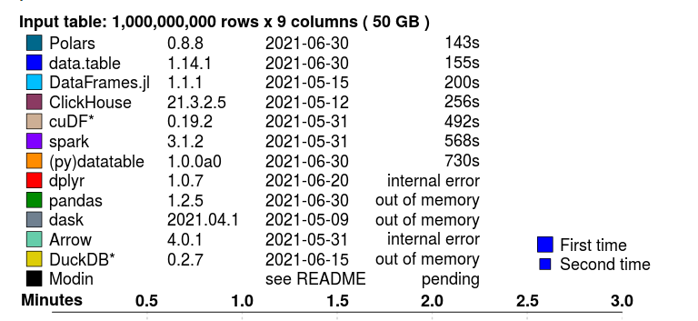

# rust

### 现成列表

1. [https://course.rs/](https://course.rs/)
2. [https://doc.rust-lang.org/stable/rust-by-example](https://doc.rust-lang.org/stable/rust-by-example)
3. [https://kaisery.github.io/trpl-zh-cn/](https://kaisery.github.io/trpl-zh-cn/)
4. [https://github.com/anshulrgoyal/rust-web-developer-roadmap/blob/master/i18n/zh-CN/README-zh-CN.md](https://github.com/anshulrgoyal/rust-web-developer-roadmap/blob/master/i18n/zh-CN/README-zh-CN.md)
5. [https://github.com/mre/idiomatic-rust](https://github.com/mre/idiomatic-rust)
6. [https://rustmagazine.github.io/rust_magazine_2021](https://rustmagazine.github.io/rust_magazine_2021)
7. [RustMagazine 中文月刊https://rustmagazine.github.io/rust_magazine_2021](https://rustmagazine.github.io/rust_magazine_2021)
8. [https://github.com/rust-unofficial/awesome-rust](https://github.com/rust-unofficial/awesome-rust)
9. [rust 语法列表 https://cheats.rs/](https://cheats.rs/)
10. [https://github.com/wubx/rust-in-databend](https://github.com/wubx/rust-in-databend)
11. [https://github.com/suhanyujie/resourses](https://github.com/suhanyujie/resourses)
12. [https://hub.fastgit.xyz/sunface/rust-course](https://hub.fastgit.xyz/sunface/rust-course)
13. [https://era.co/blog/unbuffered-io-slows-rust-programs](https://era.co/blog/unbuffered-io-slows-rust-programs)
14. [https://renato.athaydes.com/posts/how-to-write-fast-rust-code.html](https://renato.athaydes.com/posts/how-to-write-fast-rust-code.html)
15. [https://tiemoko.com/slides/SafeAndPortableDataStructureDesign_CodeAndSupply_Dec2021.pdf](https://tiemoko.com/slides/SafeAndPortableDataStructureDesign_CodeAndSupply_Dec2021.pdf)
16. [https://blog.adamchalmers.com/nom-chars/](https://blog.adamchalmers.com/nom-chars/)
17. [https://federicoterzi.com/blog/12-rust-tips-and-tricks-you-might-not-know-yet](https://federicoterzi.com/blog/12-rust-tips-and-tricks-you-might-not-know-yet)
18. [https://dev.to/sbelzile/making-games-in-rust-part-6-generating-a-map-4aic](https://dev.to/sbelzile/making-games-in-rust-part-6-generating-a-map-4aic)
19. [https://pkolaczk.github.io/server-slower-than-a-laptop/](https://pkolaczk.github.io/server-slower-than-a-laptop/)
20. [硬件rust教程 https://lupyuen.github.io/articles/rusti2c](https://lupyuen.github.io/articles/rusti2c)
21. [Easy to use RDMA API in Rust async https://github.com/datenlord/async-rdma](https://github.com/datenlord/async-rdma)
22. 

### 最佳实践
- orm
1. [orm 目前最好使用，sea-orm，它是基于 sqlx 实现的 ORM 框架，号称要实现 Rust 版本 的 ActiveRecord Ruby on Rails ](https://github.com/SeaQL/sea-orm)
2. [国内 Rust 社区小伙伴 @zhuxiujia 也实现了一个异步 ORM 框架 rbatis。Rbatis 并不是基于 sqlx 实现的，它的灵感来自于 Java 的 ORM 框架 Mybatis。Rbatis 提供了一些内置插件，可以针对一些常用场景增加开发效率。](https://github.com/rbatis/rbatis)
3. [https://github.com/ddddddO/qoo](https://github.com/ddddddO/qoo)
- web 
3. [A full-featured and easy-to-use web framework with the Rust programming language.](https://github.com/poem-web/poem)
4. [https://github.com/actix/actix-web](https://github.com/actix/actix-web)
5. 

### cheatsheet 备忘录

1.
1.

### 教程/文章/小抄/规范/记事

1. [https://tourofrust.com/00_zh-cn.html](https://tourofrust.com/00_zh-cn.html)
2. [https://github.com/rust-lang/rustlings](https://github.com/rust-lang/rustlings)
3. [https://github.com/dslchd/tokio-cn-doc](https://github.com/dslchd/tokio-cn-doc)
4. [https://github.com/tony612/tokio-internals](https://github.com/tony612/tokio-internals)
5. [https://github.com/mini-lust/tutorials https://github.com/mini-lust/tutorials](https://github.com/mini-lust/tutorials)
6. 

### web 框架

1. A web framework for Rust
   [https://github.com/SergioBenitez/Rocket](https://github.com/SergioBenitez/Rocket)
2. Actix web is a small, pragmatic, and extremely fast rust web framework.
   [https://github.com/actix/actix-web](https://github.com/actix/actix-web)
3. Serve the web – ergonomic async http server framework
   [https://github.com/http-rs/tide](https://github.com/http-rs/tide)
4. An Extensible, Concurrent Web Framework for Rust
   [https://github.com/iron/iron](https://github.com/iron/iron)
5. 完全使用rust开发的web程序[https://github.com/saschagrunert/webapp.rs](https://github.com/saschagrunert/webapp.rs)
6. 

### 实用 库/模块/框架

1. A web framework for Rust
   [https://github.com/SergioBenitez/Rocket](https://github.com/SergioBenitez/Rocket)
2. Actix web is a small, pragmatic, and extremely fast rust web framework.
   [https://github.com/actix/actix-web](https://github.com/actix/actix-web)
3. Serve the web – ergonomic async http server framework
   [https://github.com/http-rs/tide](https://github.com/http-rs/tide)
4. An Extensible, Concurrent Web Framework for Rust
   [https://github.com/iron/iron](https://github.com/iron/iron)
5. 完全使用rust开发的web程序
   [https://github.com/saschagrunert/webapp.rs](https://github.com/saschagrunert/webapp.rs)
6. Rust / Wasm framework for building client web apps Yew 是一个设计先进的 Rust 框架，目的是使用 WebAssembly 来创建多线程的前端 web 应用
   [https://github.com/yewstack/yew](https://github.com/yewstack/yew)
7. The fastest and safest AV1 encoder
   [https://github.com/xiph/rav1e](https://github.com/xiph/rav1e)
8. 漂亮得，现代化得ls
   [https://github.com/Peltoche/lsd](https://github.com/Peltoche/lsd)
9. [orm https://github.com/diesel-rs/diesel](https://github.com/diesel-rs/diesel)
10. [微软官方，Rust for the Windows SDK https://github.com/microsoft/windows-rs](https://github.com/microsoft/windows-rs)
11. [A full featured, fast Command Line Argument Parser for Rust 参数解析 https://github.com/clap-rs/clap](https://github.com/clap-rs/clap)
12. [https://github.com/launchbadge/sqlx](https://github.com/launchbadge/sqlx)
13. [类似electron https://github.com/tauri-apps/tauri](https://github.com/tauri-apps/tauri)
14. [nodejs 调用 rust A minimal library for building compiled Node.js add-ons in Rust via Node-API https://github.com/napi-rs/napi-rs](https://github.com/napi-rs/napi-rs)
15. [Safe and portable GPU abstraction in Rust, implementing WebGPU API. https://github.com/gfx-rs/wgpu](https://github.com/gfx-rs/wgpu)
16. [wgpu 是一个安全且可移植的 GPU 抽象库，实现 WebGPU API 。gpgpu-rs 在其之上创建了一个简单的 GPU 计算库。 https://github.com/UpsettingBoy/gpgpu-rs](https://github.com/UpsettingBoy/gpgpu-rs)
17. [An HTTP library for Rust https://github.com/hyperium/hyper](https://github.com/hyperium/hyper)
18. [Safe interop between Rust and C++ c++和rust互相调用 https://github.com/dtolnay/cxx](https://github.com/dtolnay/cxx)
19. [高fps SixtyFPS is a toolkit to efficiently develop fluid graphical user interfaces for any display: embedded devices and desktop applications. We support multiple programming languages, such as Rust, C++ or JavaScript. https://github.com/sixtyfpsui/sixtyfps](https://github.com/sixtyfpsui/sixtyfps)
20. [多线程数据处理 Fast multi-threaded DataFrame library in Rust and Python https://github.com/pola-rs/polars](https://github.com/pola-rs/polars)
21. [A simple and fast linear algebra library for games and graphics https://github.com/bitshifter/glam-rs](https://github.com/bitshifter/glam-rs)
22. [Go specs implemented as a scripting language in Rust. https://github.com/oxfeeefeee/goscript](https://github.com/oxfeeefeee/goscript)
23. [A runtime for writing reliable asynchronous applications with Rust. Provides I/O, networking, scheduling, timers, ... https://github.com/tokio-rs/tokio](https://github.com/tokio-rs/tokio)
24. [Standalone JIT-style runtime for WebAssembly, using Cranelift https://github.com/bytecodealliance/wasmtime](https://github.com/bytecodealliance/wasmtime)
25. [An easy and powerful Rust HTTP Client https://github.com/seanmonstar/reqwest](https://github.com/seanmonstar/reqwest)
26. [💎迄今为止最全面的分布式主键ID生成器。 💎优化的雪花算法（SnowFlake）——雪花漂移算法，在缩短ID长度的同时，具备极高瞬时并发处理能力（50W/0.1s）。 💎原生支持 C#/Java/Go/Rust/C/SQL 等多语言，且提供 PHP 扩展及 Python、Node.js、Ruby 多线程安全调用动态库（FFI）。💎支持容器环境自动扩容（自动注册 WorkerId ），单机或分布式唯一IdGenerator。💎顶尖优化，超强效能。 https://github.com/yitter/IdGenerator](https://github.com/yitter/IdGenerator)
27. [Async binding for Tungstenite, the Lightweight stream-based WebSocket implementation https://github.com/sdroege/async-tungstenite](https://github.com/sdroege/async-tungstenite)
28. [orm https://github.com/SeaQL/sea-orm](https://github.com/SeaQL/sea-orm)
29. [A rust drawing library for high quality data plotting for both WASM and native, statically and realtimely 🦀 📈🚀 https://github.com/38/plotters](https://github.com/38/plotters)
30. [Artichoke is a Ruby made with Rust Artichoke 是一个由 rust 开发的 ruby 实现，可以将 ruby 代码编译至 WebAssembly https://github.com/artichoke/artichoke](https://github.com/artichoke/artichoke)
31. [regexm 是一个用于对正则表达式进行模式匹配的库 https://github.com/TaKO8Ki/regexm](https://github.com/TaKO8Ki/regexm)
32. [slotmap 提供了三种 map 的实现, SlotMap, HopSlotMap 和 DenseSlotMap.增加,删除,查询均为O(1)复杂度,而且额外开销非常低. 非常适合存储需要稳定和安全引用的 objects, 例如游戏中的 entities, graph 中的 nodesSlotmap data structure for Rust https://github.com/orlp/slotmap](https://github.com/orlp/slotmap)
33. [SwapQueue： 一个高度优化和轻量级的crossbeam::deque替代品 一个无锁线程拥有的队列，其中任务由线程安全窃取者通过缓冲区交换而不是任务弹出来完成。 只为通过缓冲区交换来获取整个队列这一单一的使用情况而设计。通过放弃弹出单个任务的能力，可以做出一个更适合于完全批处理的数据结构。https://github.com/Bajix/swap-queue-rs](https://github.com/Bajix/swap-queue-rs)
34. [redact: 构建去中心化的、端到端加密的网站的工具https://github.com/pauwels-labs/redact-client值得一提的是，这个项目并没有用到区块链，但是其号称实现了零信任 zero-trust，相关领域的同学可以关注一下。](https://github.com/pauwels-labs/redact-client)
35. [lnx: 一个基于 tantivy 的搜索引擎https://github.com/lnx-search/lnx它是 MeiliSearch 和 ElasticSearch 的竞品。其基于 tokio-rs，hyper 和 tantivy 进行开发。提供 REST 接口。现已发布 v0.6 版。持续关注](https://github.com/lnx-search/lnx)
36. [rs-merkle：一个用Rust编写的高级散列树库 rs-merkle是一个高级的Rust merkle树库。基本功能包括构建Merkle树、创建和验证单个和多个元素的Merkle证明，即多重证明。高级功能包括对树进行事务性更改，并回滚到以前提交的任何树状态，类似于Git。 该库有两个主要结构。第一个是MerkleTree，它构建了一棵树，可用于验证数据完整性并生成Merkle证明。第二种是MerkleProof，可用于验证集合中是否包含项目。 这个库是高度可定制的。哈希算法和树的构建方式可以通过Hasher trait进行配置](https://github.com/antouhou/rs-merkle)
37. [Rust 的动态类型 dyn_struct 这个库可以安全地初始化动态大小类型 (DST)](https://github.com/nolanderc/dyn_struct)
38. [elasticsearch-dsl-rs - 用 Rust 写就的 Elasticsearch DSL 不依赖 elasticsearch-rs，可以作为独立库来方便 HTTP 客户端调用 ElasticSearch](https://github.com/vinted/elasticsearch-dsl-rs)
39. [Infinitree 嵌入式数据库 具有 3 层缓存的可扩展，加密嵌入式数据库](https://github.com/symmetree-labs/infinitree)
40. [Rust Web Local Storage API这里有一个 Rust 实现的 Web LocalStorage API，用于非浏览器环境。](https://github.com/richardanaya/web-local-storage-api)
41. [Cooptex -无死锁 Mutexes 如果Mutex:：lock调用可能会死锁，它将返回一个Err(Retry)，请求调用方删除所有持有的锁并再次尝试获取它们。这由retry_循环函数处理](https://github.com/shelbyd/cooptex)
42. [ruffle: Rust 实现的 Adob​​e Flash Player 模拟器](https://github.com/ruffle-rs/ruffle)
43. [elfshaker 是一个低占用空间、高性能的版本控制系统，针对二进制文件进行了微调 elfshaker 是一个低占用空间、高性能的版本控制系统，针对二进制文件进行了微调 有效地存储二进制对象https://github.com/elfshaker/elfshaker](https://github.com/elfshaker/elfshaker)
44. [Bagua Speeds up PyTorch https://github.com/BaguaSys/bagua](https://github.com/BaguaSys/bagua)
45. [This repository collects resources for writing clean, idiomatic Rust code https://github.com/mre/idiomatic-rust](https://github.com/mre/idiomatic-rust)
46. [可帮助您压缩和解压缩多种格式的文件 https://github.com/ouch-org/ouch](https://github.com/ouch-org/ouch)
47. [Plotters 是一个绘图库，设计用于以纯 Rust 渲染图形、绘图和图表。支持各种类型的后端，包括位图、矢量图、活塞窗口、GTK/Cairo 和 WebAssemblyhttps://crates.io/crates/debug_plotter](https://crates.io/crates/debug_plotter)
48. [这个 crate 原理仍然是将rust编译成 cdylib，然后在 c# 里面调用。不过将这个过程变得更容易了一点 https://github.com/Diggsey/rnet](https://github.com/Diggsey/rnet)
49. [https://github.com/PyO3/pyo3 https://github.com/PyO3/pyo3](https://github.com/PyO3/pyo3)
50. [Build and publish crates with pyo3, rust-cpython and cffi bindings as well as rust binaries as python packages https://github.com/PyO3/maturin](https://github.com/PyO3/maturin)
51. [https://github.com/taiki-e/pin-project](https://github.com/taiki-e/pin-project)
52. [rust 类似frp和ngrok https://github.com/rapiz1/rathole](https://github.com/rapiz1/rathole)
53. [在添加上下文时，轻松地将基础错误分配给特定于域的错误 https://github.com/shepmaster/snafu](https://github.com/shepmaster/snafu)
54. [Safe, fallible, embedded-friendly ordered set/map via a scapegoat tree. Validated against BTreeSet/BTreeMap https://github.com/tnballo/scapegoat](https://github.com/tnballo/scapegoat)
55. [又一个并行处理库，适用于在一个已有的 iterator 中加入多线程处理；如果有许多已经存储在 collection 的值，想要执行大量计算，最好使用 rayon https://github.com/dpc/pariter](https://github.com/dpc/pariter)
56. [Rayon: A data parallelism library for Rust https://github.com/rayon-rs/rayon](https://github.com/rayon-rs/rayon)
57. [是一个嵌入式加密数据库Scalable and encrypted embedded database with 3-tier caching https://github.com/symmetree-labs/infinitree](https://github.com/symmetree-labs/infinitree)
58. [Multi functional app to find duplicates, empty folders, similar images etc. https://github.com/qarmin/czkawka](https://github.com/qarmin/czkawka)
59. [MultiMedia Ingestion and Distribution System Mmids（多媒体摄取和分发系统）是一个功能强大，用户友好的开源实时视频工作流程服务器 多媒体摄取和分发系统 https://github.com/KallDrexx/mmids/](https://github.com/KallDrexx/mmids/)
60. [Implementation of basic math data types with high level frontend and low level backend  Low To High Level Math Library for Rust https://github.com/Aandreba/llml](https://github.com/Aandreba/llml)
61. [Advanced Fuzzing Library - Slot your Fuzzer together in Rust! Scales across cores and machines. For Windows, Android, MacOS, Linux, no_std https://github.com/AFLplusplus/LibAFL](https://github.com/AFLplusplus/LibAFL)
62. [Elegant React-like library for building user interfaces for desktop, web, mobile, SSR, liveview, and more. https://github.com/dioxuslabs/dioxus](https://github.com/dioxuslabs/dioxus)
63. [In short, Tremor is an event processing system. It was originally designed as a replacement for software such as Logstash or Telegraf https://github.com/tremor-rs/tremor-runtime](https://github.com/tremor-rs/tremor-runtime)
64. [Materialize是一个用于实时应用程序的流式数据库 Materialize simplifies application development with streaming data. Incrementally-updated materialized views - in PostgreSQL and in real time. Materialize is powered by Timely Dataflow https://github.com/MaterializeInc/materialize](https://github.com/MaterializeInc/materialize)
65. [A memory efficient string type that can store up to 24* bytes on the stack 一种内存高效的字符串类型，可在堆栈上存储多达 24* 个字节 https://github.com/ParkMyCar/compact_str](https://github.com/ParkMyCar/compact_str)
66. [Safe interop between Rust and Qt https://github.com/KDAB/cxx-qt](https://github.com/KDAB/cxx-qt)
67. [可以研究学习实现 https://docs.rs/zerocopy/0.6.0/zerocopy/](https://docs.rs/zerocopy/0.6.0/zerocopy/)
68. [mock数据生成 支持直接数据库插入 https://github.com/getsynth/synth](https://github.com/getsynth/synth)
69. [目前支持Python ruby Kotlin Swift， UniFFI - a multi-language bindings generator for Rust https://github.com/mozilla/uniffi-rs](https://github.com/mozilla/uniffi-rs)
70. [此项目是用于 WebAssembly 程序和 WebAssembly 嵌入的绑定生成器框架 https://github.com/bytecodealliance/wit-bindgen](https://github.com/bytecodealliance/wit-bindgen)
71. [QtQuick interface for Rust https://github.com/cyndis/qmlrs](https://github.com/cyndis/qmlrs)
72. [Use C++ libraries from Rust https://github.com/rust-qt/ritual](https://github.com/rust-qt/ritual)
73. [rust 调用qt https://rust-qt.github.io/qt/](https://rust-qt.github.io/qt/)
74. [Integrate Qml and Rust by building the QMetaObject at compile time https://github.com/woboq/qmetaobject-rs](https://github.com/woboq/qmetaobject-rs)
75. [大数据处理 速度快 Polars is a blazingly fast DataFrames library implemented in Rust using Apache Arrow Columnar Format as memory model https://github.com/pola-rs/polars](https://github.com/pola-rs/polars)

76. [https://github.com/aisk/rust-memcache](https://github.com/aisk/rust-memcache)
77. [General key value storage for actix-web with switchable backends(redis, sled, hashmaps) https://github.com/pooyamb/actix-storage](https://github.com/pooyamb/actix-storage)
78. [A native gRPC client & server implementation with async/await support. https://github.com/hyperium/tonic](https://github.com/hyperium/tonic)
79. [https://github.com/getsentry/sentry-rust](https://github.com/getsentry/sentry-rust)
80. [Time-manager of delayed tasks. Like crontab, but synchronous asynchronous tasks are possible scheduling, and dynamic add/cancel/remove is supported https://github.com/BinChengZhao/delay-timer](https://github.com/BinChengZhao/delay-timer)
81. [Simple validation for Rust structs https://github.com/Keats/validator](https://github.com/Keats/validator)
82. [A generic connection pool for Rust https://github.com/sfackler/r2d2](https://github.com/sfackler/r2d2)
83. [Rust bindings for webview, a tiny cross-platform library to render web-based GUIs for desktop applications https://github.com/Boscop/web-view](https://github.com/Boscop/web-view)
84. [Rust wrapper for Microsoft's ONNX Runtime (version 1.8) https://github.com/nbigaouette/onnxruntime-rs](https://github.com/nbigaouette/onnxruntime-rs)
85. [A fast, easy and strict URI parser written in Rust. https://github.com/yescallop/fluent-uri-rs](https://github.com/yescallop/fluent-uri-rs)
86. [This is an experimental Javascript lexer, parser and interpreter written in Rust. Currently, it has support for some of the language https://hub.fastgit.xyz/boa-dev/boa](https://hub.fastgit.xyz/boa-dev/boa)
87. [Vector is a high-performance, end-to-end (agent & aggregator) observability data pipeline that puts you in control of your observability data https://hub.fastgit.xyz/vectordotdev/vector](https://hub.fastgit.xyz/vectordotdev/vector)
88. [https://docs.rs/zerocopy/0.6.1/zerocopy/](https://docs.rs/zerocopy/0.6.1/zerocopy/)
89. [https://crates.io/crates/rust-embed](https://crates.io/crates/rust-embed)
90. [XIU是用纯Rust开发的一款简单和安全的流媒体视频服务器，目前支持流行的三大流媒体协议包括RTMP/HLS/HTTPFLV（将来有可能支持其它协议），可以单点部署，也可以用relay功能来部署集群 https://github.com/harlanc/xiu/](https://github.com/harlanc/xiu/)
91. [基于CRNN（MobileNetV3_Small + LSTM）字符识别模型，使用原神字体对原神中会出现的字符串进行训练，达到更高的速度和更精确的结果。 导出结果可以导入分析工具（例如 莫娜占卜铺 ）进行配装或者其他计算由于使用了 Rust 进行编写，运行效率和文件体积都得到了很大的提升 https://github.com/wormtql/yas](https://github.com/wormtql/yas)

### 完整项目/示例/demo/代码片段
 
1. [web 浏览器 https://github.com/servo/servo](https://github.com/servo/servo)
2. [electron rust https://github.com/AmyrAhmady/electrust](https://github.com/AmyrAhmady/electrust)
3. [Learn to write an embedded OS in Rust  https://github.com/rust-embedded/rust-raspberrypi-OS-tutorials](https://github.com/rust-embedded/rust-raspberrypi-OS-tutorials)
4. [actix 的项目示例 https://hub.fastgit.xyz/actix/examples](https://hub.fastgit.xyz/actix/examples)
5. [actix sqlx mysql https://hub.fastgit.xyz/jamesjmeyer210/actix_sqlx_mysql_user_crud](https://hub.fastgit.xyz/jamesjmeyer210/actix_sqlx_mysql_user_crud)
6. [actix jwt .env 比较全面的一个示例 https://hub.fastgit.xyz/ddimaria/rust-actix-example](https://hub.fastgit.xyz/ddimaria/rust-actix-example)
7. [https://github.com/actix/actix-extras](https://github.com/actix/actix-extras)
8. [在控制台中渲染一个字符地球可以缩放可以转动，Interactive ASCII globe generator https://github.com/adamsky/globe](https://github.com/adamsky/globe)
9. [https://github.com/fairingrey/actix-realworld-example-app](https://github.com/fairingrey/actix-realworld-example-app)
10. [https://github.com/SakaDream/actix-web-rest-api-with-jwt](https://github.com/SakaDream/actix-web-rest-api-with-jwt)
11. [https://github.com/actix/examples](https://github.com/actix/examples)
12. [Use your tablet as graphic tablet/touch screen on your computer https://github.com/H-M-H/Weylus](https://github.com/H-M-H/Weylus)
13. 

### 测试

1.
1.

### UI

1. [各种语言静态分析工具收集 https://github.com/analysis-tools-dev/static-analysis](https://github.com/analysis-tools-dev/static-analysis)
2. [egui 是一个易于使用的纯 Rust 图形用户界面。egui 可以在 Web 上、本机上以及您最喜欢的游戏引擎中运行。egui 旨在成为最容易使用的 Rust GUI 库，以及在 Rust 中制作 Web 应用程序的最简单方法，它可以在任何可以绘制纹理三角形的地方使用，这意味着您可以轻松地将其集成到您选择的游戏引擎中 https://github.com/emilk/egui](https://github.com/emilk/egui)
3. [A data-first Rust-native UI design toolkit. https://github.com/linebender/druid](https://github.com/linebender/druid)
4. [Blazing 💥 fast terminal-ui for git written in rust 🦀 https://github.com/extrawurst/gitui](https://github.com/extrawurst/gitui)
5. [https://github.com/AaronErhardt/relm4](https://github.com/AaronErhardt/relm4)
6. [https://hub.fastgit.xyz/iced-rs/iced](https://hub.fastgit.xyz/iced-rs/iced)
7. [Rust bindings for Dear ImGui https://github.com/imgui-rs/imgui-rs](https://github.com/imgui-rs/imgui-rs)
8. 

### 工具

1. [Rust 的内存安全和未定义行为检测工具 Rudra 是一个静态分析器，用于检测 Rust 程序中常见的未定义行为。它能够分析单个 Rust 包以及 crates.io 上的所有包 https://github.com/sslab-gatech/Rudra](https://github.com/sslab-gatech/Rudra)
2. [A Python Interpreter written in Rust python 解释器 https://github.com/RustPython/RustPython](https://github.com/RustPython/RustPython)
3. [远程桌面软件，开箱即用，无需任何配置https://github.com/rustdesk/rustdesk/blob/master/README-ZH.md](https://github.com/rustdesk/rustdesk/blob/master/README-ZH.md)
4. [https://hub.fastgit.org/immunant/c2rust/](https://hub.fastgit.org/immunant/c2rust/)
5. cargo-udeps 是一个了不起的项目，可帮助您分析 Rust 代码库上未使用的依赖项。您可以简单cargo install cargo-udeps地安装它。
6. [Cargo plugin for linting your dependencies https://github.com/EmbarkStudios/cargo-deny](https://github.com/EmbarkStudios/cargo-deny)
7. [Audit Cargo.lock files for dependencies with security vulnerabilities https://github.com/rustsec/rustsec](https://github.com/rustsec/rustsec)
8. [可以当做入门druid和wgpu的项目学习 Lapce is written in pure Rust, with UI in Druid. It's using Xi-Editor's Rope Science for text editing, and using Wgpu for rendering. More information on the website. https://hub.fastgit.xyz/lapce/lapce](https://hub.fastgit.xyz/lapce/lapce)
9. [Compile Cargo project with zig as linker https://github.com/messense/cargo-zigbuild](https://github.com/messense/cargo-zigbuild)
10. [wasm-pack plugin for Vite https://github.com/rwasm/vite-plugin-rsw](https://github.com/rwasm/vite-plugin-rsw)
11. [静态网站生成 https://github.com/getzola/zola](https://github.com/getzola/zola)
12. [Nickel 非常适合需要生成复杂配置的任何情况，无论是单个应用程序、计算机、整个基础结构还是构建系统 https://github.com/tweag/nickel](https://github.com/tweag/nickel)
13. [Fuzz Rust code with LibAFL https://github.com/AFLplusplus/cargo-libafl](https://github.com/AFLplusplus/cargo-libafl)
14. [Layout is a rust library and a stand alone utility that draws graphs. Layout can parse Graphviz dot files and render them https://hub.fastgit.xyz/nadavrot/layout](https://hub.fastgit.xyz/nadavrot/layout)
15. [A private network system that uses WireGuard under the hood https://hub.fastgit.xyz/tonarino/innernet](https://hub.fastgit.xyz/tonarino/innernet)
16. [cxx2flow 是国内开发者开源的一款流程图转换工具，可将 C/C++ 代码快速转换为流程图，便于增强图表复用率与团队协作效率 https://github.com/Enter-tainer/cxx2flow](https://github.com/Enter-tainer/cxx2flow)
17. 
18. 

### 游戏

1. [3D and 2D game engine written in Rust https://github.com/rg3dengine/rg3d](https://github.com/rg3dengine/rg3d)
2. [Rust bindings for GDNative https://github.com/godot-rust/godot-rust](https://github.com/godot-rust/godot-rust)
3. [2D and 3D physics engines focused on performance https://github.com/dimforge/rapier](https://github.com/dimforge/rapier)
4. 

### WebAssembly wasm

1. [A renderer written in Rust which compiles to both desktop (OpenGL) and web (WebAssembly + WebGL).asny.github.io/three-d/ https://github.com/asny/three-d](https://github.com/asny/three-d)
2. [Safe and portable GPU abstraction in Rust, implementing WebGPU API. https://github.com/gfx-rs/wgpu](https://github.com/gfx-rs/wgpu)
3. [RTS game/engine in Rust and WebGPU https://github.com/Ruddle/oxidator](https://github.com/Ruddle/oxidator)
4. [A rust drawing library for high quality data plotting for both WASM and native, statically and realtimely 🦀 📈🚀 https://github.com/38/plotters](https://github.com/38/plotters)
5. [The leading WebAssembly Runtime supporting WASI and Emscripten https://github.com/wasmerio/wasmer](https://github.com/wasmerio/wasmer)
7. [https://github.com/WasmEdge/WasmEdge](https://github.com/WasmEdge/WasmEdge)
6. 

### network tcp udp 工具库 protocol

第一第二推荐 bit解析， 数据接收使用 tokio
1. [这个比较接近 感觉可以 这个也非常不错 https://github.com/libpnet/libpnet](https://github.com/libpnet/libpnet)
2. [这个比较接近 感觉可以 https://github.com/cesbo/bitwrap](https://github.com/cesbo/bitwrap)
3. [这个比较接近 感觉可以 TODO 做一些改造 https://github.com/mengyou658/bitwrap](https://github.com/mengyou658/bitwrap)
4. [这个也比较不错，但是没有看到动态长度协议的解析 增加了order排序 https://github.com/CirrusNeptune/modular-bitfield-msb](https://github.com/CirrusNeptune/modular-bitfield-msb)
5. [这个也比较不错，但是没有看到动态长度协议的解析 没有大小端 https://github.com/Robbepop/modular-bitfield](https://github.com/Robbepop/modular-bitfield)
6. [这个里面有可以借鉴的内容 https://github.com/wwylele/byte-struct-rs](https://github.com/wwylele/byte-struct-rs)
7. [bit 协议解析 https://github.com/dzamlo/rust-bitfield](https://github.com/dzamlo/rust-bitfield)
8. [https://crates.io/crates/bitaccess_macros](https://crates.io/crates/bitaccess_macros)
9. [bit 协议解析 https://github.com/hashmismatch/packed_struct.rs](https://github.com/hashmismatch/packed_struct.rs)
10. [A runtime for writing reliable asynchronous applications with Rust. Provides I/O, networking, scheduling, timers, ... https://github.com/tokio-rs/tokio](https://github.com/tokio-rs/tokio)
11. [bit 操作工具类 https://github.com/bitvecto-rs/bitvec](https://github.com/bitvecto-rs/bitvec)
12. 
13. [Fast and easy-to-use event-driven network library. https://github.com/lemunozm/message-io](https://github.com/lemunozm/message-io)
14. [The bitmatch crate provides tools for packing and unpacking integers as sequences of bits. Supports https://github.com/porglezomp/bitmatch](https://github.com/porglezomp/bitmatch)
15. [https://github.com/contain-rs/bit-vec](https://github.com/contain-rs/bit-vec)
16. [https://github.com/dylanmckay/protocol](https://github.com/dylanmckay/protocol)
17. [框架模板 https://gitlab.com/leonhard-llc/fixed-buffer-rs](https://gitlab.com/leonhard-llc/fixed-buffer-rs)
18. [https://github.com/tokio-rs/bytes](https://github.com/tokio-rs/bytes)
19. 

### 物联网 iot 协议 protocol serial port

1. [https://github.com/bytebeamio/rumqtt](https://github.com/bytebeamio/rumqtt)
2. [https://github.com/slowtec/tokio-modbus](https://github.com/slowtec/tokio-modbus)
3. [https://github.com/berkowski/tokio-serial](https://github.com/berkowski/tokio-serial)
4. [Rust ZeroMQ bindings for Tokio https://github.com/cetra3/tmq](https://github.com/cetra3/tmq)
5. [An RPC framework for Rust with a focus on ease of use https://github.com/google/tarpc](https://github.com/google/tarpc)
6. 

### 嵌入式开发 
1. stm32
   1. https://github.com/stm32-rs 官方rust示例
   2. https://arewertosyet.com/ rtos 对比，一般选择[RTIC](https://github.com/rtic-rs/cortex-m-rtic)
   3. 另外embassy and drone no_std executors allow  to provide cooperative scheduling with await syntax
   4. 嵌入式操作系统 调试打印log [https://github.com/knurling-rs/defmt](https://github.com/knurling-rs/defmt)
   5. wifi模块http://www.hi-flying.com/
2. risc-v
   1. [The 峨眉 (EMei) JIT/AOT backend framework https://github.com/imlyzh/emei](https://github.com/imlyzh/emei)
   2. [太素OS是一个用 Rust 编写的基于 RISCV 架构的操作系统，主要用于教学目的，为初学者提供参考 https://github.com/belowthetree/TisuOS](https://github.com/belowthetree/TisuOS)
   3. [基于 RustSBI 的 labeled-RISC-V (ZCU102) 启动器 https://github.com/Gallium70/lrv-rust-bl](https://github.com/Gallium70/lrv-rust-bl)

### 区块链开发

1. [https://github.com/gakonst/foundry](https://github.com/gakonst/foundry)
2. [https://github.com/paritytech/substrate](https://github.com/paritytech/substrate)
3. [https://github.com/diem/diem](https://github.com/diem/diem)
4. 

### cargo 工具链
1. [cargo-smart-release](https://crates.io/crates/cargo-smart-release)
2. [额外工作比如copy  https://github.com/LucianoBestia/cargo-auto](https://github.com/LucianoBestia/cargo-auto)
3. [https://github.com/matklad/cargo-xtask](https://github.com/matklad/cargo-xtask)

### 数据解析器 Comparison with similar parser generators
| crate     	| parser type 	| action code 	| integration        	| input type             	| precedence climbing 	| parameterized rules 	| streaming input 	|
|-----------	|-------------	|-------------	|--------------------	|------------------------	|---------------------	|--------------------	|-----------------	|
| [peg]       	| PEG         	| in grammar  	| proc macro (block) 	| `&str`, `&[T]`, custom 	| Yes                 	| Yes                	| No              	|
| [pest]    	| PEG         	| external    	| proc macro (file)  	| `&str`                 	| Yes                 	| No                 	| No              	|
| [nom]     	| combinators 	| in source   	| library            	| `&[u8]`, custom        	| No                  	| Yes                	| Yes             	|
| [lalrpop] 	| LR(1)       	| in grammar  	| build script       	| `&str`                 	| No                  	| Yes                	| No              	|

1. [https://github.com/rrevenantt/antlr4rust](https://github.com/rrevenantt/antlr4rust)

[peg]: https://github.com/kevinmehall/rust-peg
[pest]: https://github.com/pest-parser/pest
[nom]: https://github.com/geal/nom
[lalrpop]: https://github.com/lalrpop/lalrpop

### QT
1. [QtQuick interface for Rust https://github.com/cyndis/qmlrs](https://github.com/cyndis/qmlrs)
2. [Use C++ libraries from Rust https://github.com/rust-qt/ritual](https://github.com/rust-qt/ritual)
3. [rust 调用qt https://rust-qt.github.io/qt/](https://rust-qt.github.io/qt/)
4. [Integrate Qml and Rust by building the QMetaObject at compile time https://github.com/woboq/qmetaobject-rs](https://github.com/woboq/qmetaobject-rs)

### [rust-web-framework-comparison](https://github.com/flosse/rust-web-framework-comparison)

### swagger 
1. [https://github.com/allevo/struct2swagger](https://github.com/allevo/struct2swagger)
2. [swagger 代码生成 https://github.com/adwhit/hsr](https://github.com/adwhit/hsr)
2. [swagger 代码生成 https://github.com/OpenAPITools/openapi-generator](https://github.com/OpenAPITools/openapi-generator)
2. [swagger 代码生成 https://crates.io/crates/oapi_generator](https://crates.io/crates/oapi_generator)
3. [poem-openapi 全家桶 https://crates.io/crates/poem-openapi](https://crates.io/crates/poem-openapi)

### 宏 过程宏
1. [获取crate所在的文件 https://crates.io/crates/proc-macro-crate](https://crates.io/crates/proc-macro-crate)
2. [解析宏属性 enables parsing attributes into structs https://crates.io/crates/darling](https://crates.io/crates/darling)
3. [https://crates.io/crates/proc-macro2](https://crates.io/crates/proc-macro2)
4. [https://crates.io/crates/syn](https://crates.io/crates/syn)
5. [https://crates.io/crates/proc-macro-error](https://crates.io/crates/proc-macro-error)
