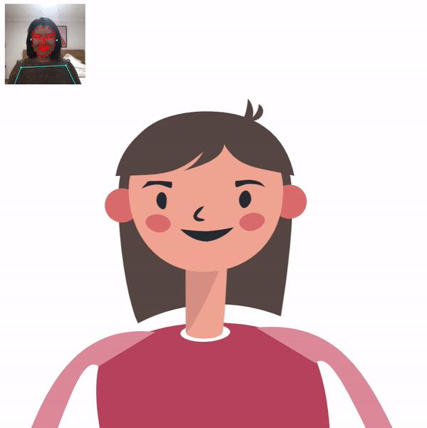
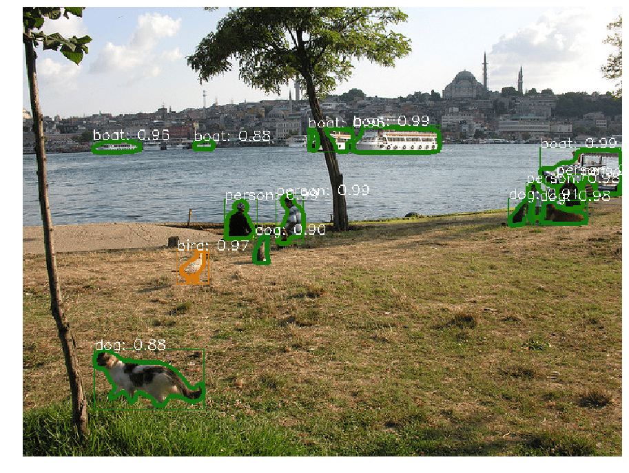
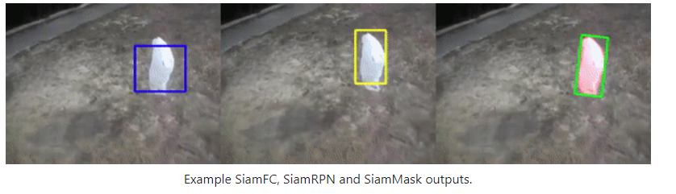

# 机器学习人工智能 深度学习 神经网络

### 现成列表
1. [最新学习路线图，https://github.com/therealsreehari/Learn-Datascience-For-Free](https://github.com/therealsreehari/Learn-Datascience-For-Free)
1. 行动识别和相关区域资源的策划清单 A curated list of action recognition and related area resources
[https://github.com/jinwchoi/awesome-action-recognition](https://github.com/jinwchoi/awesome-action-recognition)
1. A curated list of awesome computer vision resources 精彩的计算机视觉资源列表
[https://github.com/jbhuang0604/awesome-computer-vision](https://github.com/jbhuang0604/awesome-computer-vision)
1. 《动手学深度学习》，英文版即伯克利深度学习（STAT 157，2019春）教材。面向中文读者、能运行、可讨论。 http://zh.d2l.ai
[https://github.com/d2l-ai/d2l-zh](https://github.com/d2l-ai/d2l-zh)
1. cvpr2019 papers，极市团队整理
[https://github.com/extreme-assistant/cvpr2019](https://github.com/extreme-assistant/cvpr2019)
1. 深度学习面试宝典（含数学、机器学习、深度学习、计算机视觉、自然语言处理和SLAM等方向）
[https://github.com/amusi/Deep-Learning-Interview-Book](https://github.com/amusi/Deep-Learning-Interview-Book)
1. AiLearning: 机器学习 - MachineLearning - ML、深度学习 - DeepLearning - DL、自然语言处理 NLP
[https://github.com/apachecn/AiLearning](https://github.com/apachecn/AiLearning)
1. 可解释的机器学习--黑盒模型可解释性理解指南
[https://github.com/MingchaoZhu/InterpretableMLBook](https://github.com/MingchaoZhu/InterpretableMLBook)
1. [一款入门级的人脸、视频、文字检测以及识别的项目 https://github.com/vipstone/faceai](https://github.com/vipstone/faceai)

### 新手入门项目
1. 一款优秀入门级 AI 项目以及教程，内容涵盖：人脸、视频、文字的检测和识别。他不仅包含最基本的人脸检测、识别（图片、视频）、轮廓标识、头像合成（给人戴帽子），还有表情识别（生气、厌恶、恐惧等）、视频对象提取、图片修复（可用于水印去除）、图片自动上色等等。推荐这个开源项目不是因为它的内容强大，而是它的教程写的实在太好了，真 · 入门级。手把手教你如何使用这个项目，做出上述功能来。在每篇功能文章的教程里，不仅仅写了每个功能的技术实现方案，还有具体重点关键代码的注释和解释以及具体实现，让你非常轻松的能够看懂、学习和使用。对于想要入门或者了解机器学习的初学者不能再友好了。
[https://github.com/vipstone/faceai](https://github.com/vipstone/faceai)
1. 完整的目标检测项目。结构简洁明了，中文注释。适宜新手入门、目标检测任务参考，甚至直接基于本项目实现目标检测任务。
[https://github.com/yatengLG/SSD-Pytorch](https://github.com/yatengLG/SSD-Pytorch)
1. 该项目使用 Python 实现了 11 种经典的数据抽取（数据降维）算法。同时附有相关资料、展示效果，适用于机器学习初学者和刚刚入坑数据挖掘的小伙伴
[https://github.com/heucoder/dimensionality_reduction_alo_codes](https://github.com/heucoder/dimensionality_reduction_alo_codes)
1. 一个包含基础教程、提高参考资料、有趣实践项目的 PyTorch 教程。
[https://github.com/Eurus-Holmes/LIS-YNP](https://github.com/Eurus-Holmes/LIS-YNP)
1. 
1. 
1. 

### cheatsheet 备忘录
1.
1.

### 教程/文章/小抄/规范/记事
1. Machine Learning 机器学习教程 Go教程  JavaScript教程 ios开发教程 Protocol协议教程 http https websocket tcp tls
[https://github.com/halfrost/Halfrost-Field](https://github.com/halfrost/Halfrost-Field)
1. tensorflow2中文教程
[https://github.com/czy36mengfei/tensorflow2_tutorials_chinese](https://github.com/czy36mengfei/tensorflow2_tutorials_chinese)
1. TensorFlow 2.0深度学习开源书
[https://github.com/dragen1860/Deep-Learning-with-TensorFlow-book](https://github.com/dragen1860/Deep-Learning-with-TensorFlow-book)
1. Tensorflow实战学习笔记、代码、机器学习进阶系列
[https://github.com/MachineLP/Tensorflow-](https://github.com/MachineLP/Tensorflow-)
1. 机器学习入门路径
[https://github.com/clone95/Virgilio/tree/master/zh-CN/LearningPaths/Machine%20Learning%20Engineer%20Career%20Path](https://github.com/clone95/Virgilio/tree/master/zh-CN/LearningPaths/Machine%20Learning%20Engineer%20Career%20Path)
1. A Chinese Translation of Stanford CS229 notes 斯坦福机器学习CS229课程讲义的中文翻译 https://zhuanlan.zhihu.com/python-kivy
[https://github.com/Kivy-CN/Stanford-CS-229-CN](https://github.com/Kivy-CN/Stanford-CS-229-CN)
1. 基于视频的目标检测算法研究 对相应的视频目标检测论文整理实现综述文档。
[https://github.com/guanfuchen/video_obj](https://github.com/guanfuchen/video_obj)
1. 机器学习实战（Python3）：kNN、决策树、贝叶斯、逻辑回归、SVM、线性回归、树回归
[https://github.com/Jack-Cherish/Machine-Learning](https://github.com/Jack-Cherish/Machine-Learning)
1. 计算机视觉相关论文整理、翻译、记录、分享; 包括图像分类、目标检测、视觉跟踪/目标跟踪、人脸识别/人脸验证、OCR/场景文本检测、识别等领域。
[https://github.com/yizt/cv-papers](https://github.com/yizt/cv-papers)
1.  深度学习500问，以问答形式对常用的概率知识、线性代数、机器学习、深度学习、计算机视觉等热点问题进行阐述，以帮助自己及有需要的读者。 全书分为18个章节，近30万字。由于水平有限，书中不妥之处恳请广大读者批评指正。
未完待续............ 如有意合作，联系scutjy2015@163.com 版权所有，违权必究 Tan 2018.06
[https://github.com/scutan90/DeepLearning-500-questions](https://github.com/scutan90/DeepLearning-500-questions)
1. 车牌识别训练代码 Training Tools Related to HyperLPR
[https://github.com/zeusees/HyperLPR-Training](https://github.com/zeusees/HyperLPR-Training)
1. 2018/2019/校招/春招/秋招/算法/机器学习(Machine Learning)/深度学习(Deep Learning)/自然语言处理(NLP)/C/C++/Python/面试笔记
[https://github.com/imhuay/Algorithm_Interview_Notes-Chinese](https://github.com/imhuay/Algorithm_Interview_Notes-Chinese)
1. AiLearning: 机器学习 - MachineLearning - ML、深度学习 - DeepLearning - DL、自然语言处理 NLP
[https://github.com/apachecn/AiLearning](https://github.com/apachecn/AiLearning)
1. 自然语言转逻辑形式"研究资料收集
[https://github.com/BaeSeulki/NL2LF](https://github.com/BaeSeulki/NL2LF)
1. 机器学习视频教程
[https://morvanzhou.github.io/tutorials/machine-learning/ML-intro/1-1-machine-learning/](https://morvanzhou.github.io/tutorials/machine-learning/ML-intro/1-1-machine-learning/)
1. Sklearn 与 TensorFlow 机器学习实用指南
[https://github.com/apachecn/hands-on-ml-zh](https://github.com/apachecn/hands-on-ml-zh)
1. 机器学习实战（Python3）：kNN、决策树、贝叶斯、逻辑回归、SVM、线性回归、树回归 https://cuijiahua.com/blog/ml/
[https://github.com/Jack-Cherish/Machine-Learning](https://github.com/Jack-Cherish/Machine-Learning)
1.  [译] 利用 Python 进行数据分析 · 第 2 版
[https://github.com/apachecn/pyda-2e-zh](https://github.com/apachecn/pyda-2e-zh)
1. YOLO v3 目标检测算法 源码
[https://github.com/SpikeKing/keras-yolo3-detection](https://github.com/SpikeKing/keras-yolo3-detection)
1. Detectron2 is FAIR's next-generation platform for object detection and segmentation. 目标检测算法
[https://github.com/facebookresearch/detectron2](https://github.com/facebookresearch/detectron2)
1. 利用YOLOv3结合行人重识别模型，实现行人的检测识别，查找特定行人
[https://github.com/songwsx/person_search_demo](https://github.com/songwsx/person_search_demo)
1. 机器人视觉 移动机器人 VS-SLAM ORB-SLAM2 深度学习目标检测 yolov3 行为检测 opencv PCL 机器学习 无人驾驶
[https://github.com/Ewenwan/MVision](https://github.com/Ewenwan/MVision)
1. 为 TF 2017 打造的新版可视化教学代码 可视化的教程
[https://github.com/MorvanZhou/Tensorflow-Tutorial](https://github.com/MorvanZhou/Tensorflow-Tutorial)
1. 自动视频剪辑 自动编辑视频
[https://github.com/carykh/jumpcutter](https://github.com/carykh/jumpcutter)
1. Examples of using sparse attention, as in "Generating Long Sequences with Sparse Transformers" OpenAI
[https://github.com/openai/sparse_attention](https://github.com/openai/sparse_attention)
1. 机器学习 相关列表
[https://github.com/ty4z2008/Qix/blob/master/dl.md](https://github.com/ty4z2008/Qix/blob/master/dl.md)
1.  流行的机器学习算法的Python示例，解释了交互式Jupyter演示和数学  Python examples of popular machine learning algorithms with interactive Jupyter demos and math being explained
[https://github.com/trekhleb/homemade-machine-learning](https://github.com/trekhleb/homemade-machine-learning)
1. 面向机器学习的特征工程 开源的机器学习电子书的中文翻译，内容主要是关于如何找到数据集的特征
http://fe4ml.apachecn.org/#/
1. 台湾大学李宏毅老师机器学习
[https://github.com/dafish-ai/NTU-Machine-learning](https://github.com/dafish-ai/NTU-Machine-learning)
1. 一种实用的机器学习方法 A practical approach to machine learning
[https://github.com/GokuMohandas/practicalAI](https://github.com/GokuMohandas/practicalAI)
1. 本社区是微软亚洲研究院（Microsoft Research Asia，简称MSRA）人工智能教育团队创立的人工智能教育与学习共建社区
[https://github.com/microsoft/ai-edu](https://github.com/microsoft/ai-edu)
1. 机器学习入门示例 TensorFlow Tutorial and Examples for Beginners
[https://github.com/aymericdamien/TensorFlow-Examples](https://github.com/aymericdamien/TensorFlow-Examples)
1. 人工智能学习路线图，整理近200个实战案例与项目，免费提供配套教材，零基础入门，就业实战！包括：Python，数学，机器学习，数据分析，深度学习，计算机视觉，自然语言处理等热门领域
[https://github.com/tangyudi/Ai-learn](https://github.com/tangyudi/Ai-learn)
1. 机器学习模型推导教程
[https://github.com/shuhuai007/Machine-Learning-Session](https://github.com/shuhuai007/Machine-Learning-Session)
1. TensorFlow 2.0 + Keras中的说明性ML笔记本
[https://github.com/practicalAI/practicalAI](https://github.com/practicalAI/practicalAI)
1. [https://github.com/sun1638650145/A2PI2/blob/master/%E6%9C%BA%E5%99%A8%E5%AD%A6%E4%B9%A0.md整理的机器学习中用到所有API，周更；从本次更新开始加入机器学习笔记，不定期更新](https://github.com/sun1638650145/A2PI2/blob/master/%E6%9C%BA%E5%99%A8%E5%AD%A6%E4%B9%A0.md)
1. [https://github.com/Niutranser-Li/Machine-Learning-Algorithm机器学习（统计方法+深度学习）理论方法+技术实战、数据集资源、学习方法和技术客栈](https://github.com/Niutranser-Li/Machine-Learning-Algorithm)
1. [https://github.com/Giyn/MachineLearningAlgorithm机器学习算法教程和说明](https://github.com/Giyn/MachineLearningAlgorithm)
1. [https://github.com/OneStepAndTwoSteps/Data_Analysis_notes学习机器学习时，最好使用真实数据，而不是人工数据集。幸运的是，有上千个开源数据集 可以进行选择，涵盖多个领域。以下是一些可以查找的数据的地方：](https://github.com/OneStepAndTwoSteps/Data_Analysis_notes)
    *   __流行的开源数据仓库：__ 
        *   [UC	Irvine	Machine	Learning Repository](https://link.jianshu.com/?t=http%3A%2F%2Farchive.ics.uci.edu%2Fml%2F)
        *   [Kaggle	datasets](https://link.jianshu.com/?t=https%3A%2F%2Fwww.kaggle.com%2Fdatasets)   
        *   [Amazon’s AWS datasets](https://link.jianshu.com/?t=http%3A%2F%2Faws.amazon.com%2Ffr%2Fdatasets%2F)
    *   __准入口（提供开源数据列表）__
        *   http://dataportals.org/ 
        *   http://opendatamonitor.eu/ 
        *   http://quandl.com/ 
    *   __其它列出流行开源数据仓库的网页：__ 
        *   [Wikipedia’s list of Machine Learning datasets](https://link.jianshu.com/?t=https%3A%2F%2Fgoo.gl%2FSJHN2k)
        *   [Quora.com question](https://link.jianshu.com/?t=http%3A%2F%2Fgoo.gl%2FzDR78y)
        *   [Datasets subreddit](https://link.jianshu.com/?t=https%3A%2F%2Fwww.reddit.com%2Fr%2Fdatasets)
1. [https://github.com/CodecWang/OpenCV-Python-Tutorial opencv 教程](https://github.com/CodecWang/OpenCV-Python-Tutorial)
1. [数据科学竞赛经验分享 https://github.com/yzkang/My-Data-Competition-Experience/](https://github.com/yzkang/My-Data-Competition-Experience/)
1.
1.
### 实用 库/模块/框架
1. A face detection library in 200 lines of JavaScript （人脸检测 JavaScript ）
[https://github.com/mengyou658/picojs](https://github.com/mengyou658/picojs)
1. tensorflow
[https://github.com/tensorflow/tensorflow](https://github.com/tensorflow/tensorflow)
1. TensorFlow.js
[https://github.com/mengyou658/tfjs](https://github.com/mengyou658/tfjs)
1. Automatically "block" people in images (like Black Mirror) using a pretrained neural network. 使用预训练的神经网络自动“阻挡”图像中的人（如黑镜）
(自动识别图片中的人，车，长颈鹿，等80多种不同类型的对象，然后进行遮挡) (Python TensorFlow Keras Numpy，skimage，scipy，Pillow，cython，h5py)
[https://github.com/mengyou658/person-blocker](https://github.com/mengyou658/person-blocker)
1. Friendly machine learning for the web! 友好的 机器学习 web js
[https://github.com/ml5js/ml5-library](https://github.com/ml5js/ml5-library)
1. JavaScript中的神经网络
[https://github.com/BrainJS/brain.js](https://github.com/BrainJS/brain.js)
1. 用python3+opencv3做的中国车牌识别，包括算法和客户端界面，只有2个文件，surface.py是界面代码，predict.py是算法代码，界面不是重点所以用tkinter写得很简单
[https://github.com/wzh191920/License-Plate-Recognition](https://github.com/wzh191920/License-Plate-Recognition)
1. Car Recognition with Deep Learning 车辆识别
[https://github.com/foamliu/Car-Recognition](https://github.com/foamliu/Car-Recognition)
1.  The world's simplest facial recognition api for Python and the command line 世界上最简单的人脸识别库，使用 Python 或命令行，即可识别和控制人脸。该库使用 dlib 顶尖的深度学习人脸识别技术构建，在户外脸部检测数据库基准（Labeled Faces in the Wild benchmark）上的准确率高达 99.38%。
[https://github.com/mengyou658/face_recognition](https://github.com/mengyou658/face_recognition)
1. 自动车牌识别库 http://www.openalpr.com Automatic License Plate Recognition library
[https://github.com/openalpr/openalpr](https://github.com/openalpr/openalpr)
1. 人脸识别 Face recognition using Tensorflow
[https://github.com/davidsandberg/facenet](https://github.com/davidsandberg/facenet)
1. 简单的语音识别 Speech recognition for your site
[https://github.com/TalAter/annyang](https://github.com/TalAter/annyang)
1. ANTLR（另一种语言识别工具）是一个功能强大的解析器生成器，用于读取，处理，执行或翻译结构化文本或二进制文件。 语法解析 ANTLR (ANother Tool for Language Recognition) is a powerful parser generator for reading, processing, executing, or translating structured text or binary files. http://antlr.org
[https://github.com/antlr/antlr4](https://github.com/antlr/antlr4)
1. 人脸识别 JavaScript API for face detection and face recognition in the browser and nodejs with tensorflow.js
[https://github.com/justadudewhohacks/face-api.js](https://github.com/justadudewhohacks/face-api.js)
1. 互联网上的人物跟踪器：Jose Pino的OSINT分析和研究工具 互联网上的人物跟踪器：学习跟踪世界，避免被追踪。Trape是一种OSINT分析和研究工具，它允许人们实时跟踪和执行智能社交工程攻击。它的创建目的是向全世界教授大型互联网公司如何获取机密信息，例如其网站或服务的会话状态，并通过浏览器控制用户，而不是他们的知识，但它的发展是为了帮助政府组织，公司和研究人员跟踪网络犯罪分子。
People tracker on the Internet: OSINT analysis and research tool by Jose Pino Trape is an OSINT analysis and research tool, which allows people to track and execute intelligent social engineering attacks in real time. It was created with the aim of teaching the world how large Internet companies could obtain confidential information such as the status of sessions of their websites or services and control their users through their browser, without their knowlege, but It evolves with the aim of helping government organizations, companies and researchers to track the cybercriminals.
[https://github.com/jofpin/trape](https://github.com/jofpin/trape)
1. 人脸识别
[https://github.com/deepinsight/insightface/issues/256 包含训练数据下载](https://github.com/deepinsight/insightface/issues/256 包含训练数据下载)
[https://github.com/deepinsight/insightface](https://github.com/deepinsight/insightface)
1. 基于深度学习高性能中文车牌识别 High Performance Chinese License Plate Recognition Framework.
[https://github.com/zeusees/HyperLPR](https://github.com/zeusees/HyperLPR)
1. 文字识别 其实现在做文字识别不是很难，特别基于深度学习
[https://github.com/JinpengLI/deep_ocr](https://github.com/JinpengLI/deep_ocr)
1. 一款入门级的人脸、视频、文字检测以及识别的项目.人脸检测、识别（图片、视频）
                           轮廓标识
                           头像合成（给人戴帽子）
                           数字化妆（画口红、眉毛、眼睛等）
                           性别识别
                           表情识别（生气、厌恶、恐惧、开心、难过、惊喜、平静等七种情绪）
                           视频对象提取
                           图片修复（可用于水印去除）
                           图片自动上色
                           眼动追踪（待完善）
                           换脸（待完善）
[https://github.com/vipstone/faceai](https://github.com/vipstone/faceai)
1. 基于深度学习高性能中文车牌识别 High Performance Chinese License Plate Recognition Framework
[https://github.com/zeusees/HyperLPR](https://github.com/zeusees/HyperLPR)
1. 基于python图像识别实现的连连看外挂，可实现QQ连连看秒破
[https://github.com/TheThreeDog/Auto-Lianliankan](https://github.com/TheThreeDog/Auto-Lianliankan)
1. Deep Pose Estimation implemented using Tensorflow with Custom Architectures for fast inference. 使用Tensorflow和自定义架构实现深度姿态估计，以实现快速推理 识别人体骨架 人体动作
[https://github.com/ildoonet/tf-pose-estimation](https://github.com/ildoonet/tf-pose-estimation)
1. TensorFlow android demo 车道线 车辆 人脸 动作 骨架 识别 检测
[https://github.com/yuxitong/TensorFlowAndroidDemo](https://github.com/yuxitong/TensorFlowAndroidDemo)
1. 换脸 Faceswap
[https://github.com/deepfakes/faceswap](https://github.com/deepfakes/faceswap)
1.  端到端的三维人脸重建，基于 MobileNet 网络框架，在 CPU 上能达到实时。  The pytorch improved re-implementation of TPAMI 2017 paper: Face Alignment in Full Pose Range: A 3D Total Solution.
[https://github.com/cleardusk/3DDFA](https://github.com/cleardusk/3DDFA)
1. 身份证识别 ocr
[https://github.com/isee15/Card-Ocr](https://github.com/isee15/Card-Ocr)
1. 一个开源的 OCR 软件，支持识别40种语言，包括中日韩文字
[https://github.com/JaidedAI/EasyOCR](https://github.com/JaidedAI/EasyOCR)
1. wukong-robot 是一个简单、灵活、优雅的中文语音对话机器人/智能音箱项目。 https://wukong.hahack.com/
[https://github.com/wzpan/wukong-robot](https://github.com/wzpan/wukong-robot)
1. 用于构建机器人的NLP库，具有实体提取，情感分析，自动语言识别等功能 An NLP library for building bots, with entity extraction, sentiment analysis, automatic language identify, and so more
[https://github.com/axa-group/nlp.js](https://github.com/axa-group/nlp.js)
1. Keras的超参数调谐器，专门用于tf.kerasTensorFlow 2.0
[https://github.com/keras-team/keras-tuner](https://github.com/keras-team/keras-tuner)
1. 在5秒内克隆语音，实时生成任意语音 Clone a voice in 5 seconds to generate arbitrary speech in real-time
[https://github.com/CorentinJ/Real-Time-Voice-Cloning](https://github.com/CorentinJ/Real-Time-Voice-Cloning)

1. NSFW detection on the client-side via Tensorflow JS
[https://github.com/infinitered/nsfwjs](https://github.com/infinitered/nsfwjs)
1. 本项目face_recognition是一个强大、简单、易上手的人脸识别开源项目，并且配备了完整的开发文档和应用案例，特别是兼容树莓派系统。本项目的人脸识别是基于业内领先的C++开源库 dlib中的深度学习模型，用Labeled Faces in the Wild人脸数据集进行测试，有高达99.38%的准确率。但对小孩和亚洲人脸的识别准确率尚待提升。
face_recognition is a powerful, simple and easy-to-use face recognition open source project with complete development documents and application cases, especially it is compatible with Raspberry Pi
[https://github.com/ageitgey/face_recognition](https://github.com/ageitgey/face_recognition)
1. Keras是一个高级神经网络API，用Python编写，能够在TensorFlow，CNTK或Theano之上运行。它的开发重点是实现快速实验。能够以最小的延迟从理念到结果是进行良好研究的关键。
Keras is a high-level neural networks API, written in Python and capable of running on top of TensorFlow, CNTK, or Theano. It was developed with a focus on enabling fast experimentation. Being able to go from idea to result with the least possible delay is key to doing good research.
[https://github.com/keras-team/keras](https://github.com/keras-team/keras)
1. Keras model to generate HTML code from hand-drawn website mockups. Implements an image captioning architecture to drawn source images.
人工智能生成前端网页的工具，已经可用了。自动将手绘图，变成 HTML 网页。作者还写了一篇文章介绍原理 手写 草稿 草图
[https://github.com/ashnkumar/sketch-code](https://github.com/ashnkumar/sketch-code)
1. FastFCN: Rethinking Dilated Convolution in the Backbone for Semantic Segmentation
[https://github.com/wuhuikai/FastFCN](https://github.com/wuhuikai/FastFCN)
1. 使用深度学习,神经网络去除马赛克 视频 马赛克
[https://github.com/deeppomf/DeepCreamPy](https://github.com/deeppomf/DeepCreamPy)
1. sqlflow简化 机器学习
[https://github.com/sql-machine-learning/sqlflow](https://github.com/sql-machine-learning/sqlflow)
1. 车辆自动驾驶客户端 本田，丰田，讴歌，雷克萨斯，雪佛兰，现代，起亚执行自适应巡航控制（ACC）和车道保持辅助系统（LKAS）的功能
[https://github.com/commaai/openpilot](https://github.com/commaai/openpilot)
1. Google X Lab 与加拿大 Perimeter 理论物理研究所的研究人员合作开发了TensorNetwork，以 TensorFlow 作为后端，针对 GPU 处理进行了优化。相比于单纯基于 CPU 的计算工作，TensorNetwork 可以实现高达 100 倍的加速。A library for easy and efficient manipulation of tensor networks.
[https://github.com/google/TensorNetwork](https://github.com/google/TensorNetwork)
1. Official Tensorflow implementation of U-GAT-IT: Unsupervised Generative Attentional Networks with Adaptive Layer-Instance Normalization for Image-to-Image Translation
[https://github.com/taki0112/UGATIT](https://github.com/taki0112/UGATIT)
1. 该仓库将包含TecoGAN项目的源代码和材料，即TEmporally COherent GAN的代码 模糊像素变高清
[https://github.com/thunil/TecoGAN](https://github.com/thunil/TecoGAN)
1. [StyleGAN2-ADA - Official PyTorch implementation https://github.com/NVlabs/stylegan2-ada-pytorch](https://github.com/NVlabs/stylegan2-ada-pytorch)
1. High-performance TensorFlow library for quantitative finance TensorFlow 高性能工具库
[https://github.com/google/tf-quant-finance](https://github.com/google/tf-quant-finance)
1. 人脸替换 DeepPrivacy是一种全自动的图像匿名化技术
[https://github.com/hukkelas/DeepPrivacy](https://github.com/hukkelas/DeepPrivacy)
1. A High-Quality Real Time Upscaler for Anime Video 实时提升卡通动画的分辨率，使其成为高清动画的工具 动漫
[https://github.com/bloc97/Anime4K](https://github.com/bloc97/Anime4K)
1. 图像查重 Finding duplicate images made easy!
[https://github.com/idealo/imagededup](https://github.com/idealo/imagededup)
1. 使用机器学习算法完成对12306验证码的自动识别
[https://github.com/zhaipro/easy123061.](https://github.com/zhaipro/easy123061.)
1. test_cnn基于keras，可以用来破解宝塔面板的验证码。基于深度学习的技术，识别效果接近100%准确
[https://github.com/imfht/test_cnn/blob/master/README_CN.md](https://github.com/imfht/test_cnn/blob/master/README_CN.md)
1. an implementation of 3D Ken Burns Effect from a Single Image using PyTorch 单个图像合成3D Ken Burns效果
[https://github.com/sniklaus/3d-ken-burns](https://github.com/sniklaus/3d-ken-burns)
1. 英伟达最强图像生成器StyleGAN2 StyleGAN2 - Official TensorFlow Implementation
[https://github.com/NVlabs/stylegan2](https://github.com/NVlabs/stylegan2)
1. 这是一个用StyleGAN训练出的网红脸生成器
[https://github.com/a312863063/seeprettyface-generator-wanghong](https://github.com/a312863063/seeprettyface-generator-wanghong)
1. Implementation EfficientDet: Scalable and Efficient Object Detection in PyTorch 图像识别
[https://github.com/toandaominh1997/EfficientDet.Pytorch](https://github.com/toandaominh1997/EfficientDet.Pytorch)
1. 一个 Tensorflow 的算法实现，可以通过机器学习，将一片漆黑的照片（最左侧）还原成有光时的样子（最右侧）。
[https://github.com/cchen156](https://github.com/cchen156)
1. 一个开源软件，只需要提供一张头像照片，就可以生成人物开口讲话的视频。
[https://github.com/alievk/avatarify](https://github.com/alievk/avatarify)
1. 使用AR剪切并粘贴周围的环境
[https://github.com/cyrildiagne/ar-cutpaste](https://github.com/cyrildiagne/ar-cutpaste)
1. Pose Animator takes a 2D vector illustration and animates its containing curves in real-time based on the recognition result from PoseNet and FaceMesh. It borrows the idea of skeleton-based animation from computer graphics and applies it to vector characters.
 人脸动作转换成动画
[https://github.com/yemount/pose-animator](https://github.com/yemount/pose-animator)
1. 将图片转成卡通图像
[https://github.com/minivision-ai/photo2cartoon](https://github.com/minivision-ai/photo2cartoon)
1. 中文文本纠错工具。音似、形似错字（或变体字）纠正，可用于中文拼音、笔画输入法的错误纠正。依据语言模型检测错别字位置，通过拼音音似特征、笔画五笔编辑距离特征及语言模型困惑度特征纠正错别字。解决了在文本识别模型处理后，对识别结果中个别词汇错误进行纠错
[https://github.com/shibing624/pycorrector](https://github.com/shibing624/pycorrector)
1. comma.ai 开源的自动驾驶系统
[https://github.com/commaai/openpilot](https://github.com/commaai/openpilot)
1. 基于卷积神经网络和监督学习的开源库，可以实现人的面部、躯干和四肢甚至手指的跟踪。适用于多人，且标记准确
[https://github.com/CMU-Perceptual-Computing-Lab/openpose](https://github.com/CMU-Perceptual-Computing-Lab/openpose)
1. “Bye Bye TPU”，4 个 GPU 就能训练“史上最强” BigGAN！只需 4-8 个 GPU 即可训练，摆脱了算力束缚
[https://github.com/ajbrock/BigGAN-PyTorch](https://github.com/ajbrock/BigGAN-PyTorch)
1. OpenAI 发布的 15 亿参数量通用语言模型 GPT-2，迄今最大模型！展示了一种构建语言处理系统的潜在方式，即根据自然发生的演示学习执行任务。
[https://github.com/openai/gpt-2](https://github.com/openai/gpt-2)
1. OpenAI 发布的 15 亿参数量通用语言模型 GPT-3，迄今最大模型！展示了一种构建语言处理系统的潜在方式，即根据自然发生的演示学习执行任务。
[https://github.com/openai/gpt-3](https://github.com/openai/gpt-3)
1. 该项目是论文 S3FD:Single Shot Scale-invariant Face Detector 的 pytorch 复现版本。S3FD 目前在 FDDB 的评测中排在前几位，属于精度较高的人脸检测方法。论文主要解决人脸尺度问题，进一步提升对小脸的检测
[https://github.com/yxlijun/S3FD.pytorch](https://github.com/yxlijun/S3FD.pytorch)
1. The fastai deep learning library, plus lessons and tutorials
[https://github.com/fastai/fastai](https://github.com/fastai/fastai)
1. 图片转3d模型 PIFuHD: Multi-Level Pixel-Aligned Implicit Function for High-Resolution 3D Human Digitization (CVPR 2020)
[https://github.com/facebookresearch/pifuhd](https://github.com/facebookresearch/pifuhd)
1. 根据模糊图片，生成虚构面孔 我们已经注意到很多人担心PULSE将用于识别脸部模糊的个人。我们要强调的是，这是不可能的-PULSE制作不存在的人的虚构面孔，不应将其与真实的人混淆。它不会帮助识别或重建原始图像
[https://github.com/adamian98/pulse](https://github.com/adamian98/pulse)
1. [https://github.com/NathanUA/U-2-Net](https://github.com/NathanUA/U-2-Net)
1. 
1.
1.
1.
1.

### 现成解决方案/完整项目/示例/demo/代码片段
1. CV算法复现
[https://github.com/bbaibowen/computer-vision](https://github.com/bbaibowen/computer-vision)
1. MediaPipe is the simplest way for researchers and developers to build world-class ML solutions and applications for mobile, edge, cloud and the web. 
现成的解决方案：包括，人脸检测，
* [Face Detection人脸识别](mediapipe/docs/face_detection_mobile_gpu.md) [(web demo)](https://viz.mediapipe.dev/runner/demos/face_detection/face_detection.html)
* [Face Mesh人脸合成](mediapipe/docs/face_mesh_mobile_gpu.md)
* [Hand Detection手识别](mediapipe/docs/hand_detection_mobile_gpu.md)
* [Hand Tracking手追踪](mediapipe/docs/hand_tracking_mobile_gpu.md) [(web demo)](https://viz.mediapipe.dev/runner/demos/hand_tracking/hand_tracking.html)
* [Multi-hand Tracking多手追踪](mediapipe/docs/multi_hand_tracking_mobile_gpu.md)
* [Hair Segmentation头发分割](mediapipe/docs/hair_segmentation_mobile_gpu.md) [(web demo)](https://viz.mediapipe.dev/runner/demos/hair_segmentation/hair_segmentation.html)
* [Object Detection物体识别](mediapipe/docs/object_detection_mobile_gpu.md)
* [Object Detection and Tracking物体识别和追踪](mediapipe/docs/object_tracking_mobile_gpu.md)
* [Objectron: 3D Object Detection and Tracking3D对象检测和跟踪](mediapipe/docs/objectron_mobile_gpu.md)
* [AutoFlip: Intelligent Video Reframing智能视频重帧](mediapipe/docs/autoflip.md)
* [KNIFT: Template Matching with Neural Image Features具有神经图像特征的模板匹配](mediapipe/docs/template_matching_mobile_cpu.md)

[https://github.com/google/mediapipe](https://github.com/google/mediapipe)
1. [https://github.com/ghostwwl/machine_learning机器学习相关的呢! 里面所有自有代码BSD协议放出!](https://github.com/ghostwwl/machine_learning)
1. [https://github.com/fuyanzhang/aicar 应该还没有完善 基于树莓派做的一些玩具，主要为了学习机器学习相关知识 这里是一些过程代码及测试代码。随手一写，并无特别的设计](https://github.com/fuyanzhang/aicar)
1. [https://github.com/tower111/binary_volnerablity_mining基于机器学习的二进制文件漏洞挖掘项目的个人文档原项目地址https://github.com/lucamassarelli/Unsupervised-Features-Learning-For-Binary-Similarity这里对源代码以及论文进行了一些分析](https://github.com/tower111/binary_volnerablity_mining)
1. [要快速地进行模型在移动设备上的效果验证https://github.com/peng-zhihui/DeepVision](https://github.com/peng-zhihui/DeepVision)
1. 
1. 
1. 
1. 

### 测试
1.
1.

### UI
1.
1.

### 工具 增强
1. [在我很多项目中用到的CV算法推理框架应用https://github.com/peng-zhihui/DeepVision](https://github.com/peng-zhihui/DeepVision)
1. Streamlit — The fastest way to build custom ML tools 交互互动的可视化工具，可以快速创建交互的界面，自行调节参数 https://streamlit.io/  jasper-notebook 功能升级
[https://github.com/streamlit/streamlit](https://github.com/streamlit/streamlit)
1. HiPlot使理解高维数据变得容易
[https://github.com/facebookresearch/hiplot](https://github.com/facebookresearch/hiplot)

1. 构建机器学习API，多重框架：部署TensorFlow，PyTorch，scikit-learn和其他模型
[https://github.com/cortexlabs/cortex](https://github.com/cortexlabs/cortex)
1. [闪电通过将科学与工程脱钩来帮助提高生产力。从某种意义上说，它使您的代码更简洁，有点像TensorFlow的Keras。但是，这并不能控制您。它仍然是PyTorch，您可以访问所有常用的API https://github.com/PyTorchLightning/PyTorch-lightning](https://github.com/PyTorchLightning/PyTorch-lightning)   

### 工具
1. Learning Convolutional Neural Networks with Interactive Visualization. 以可视化的形式来训练和调参机器学习
[https://github.com/poloclub/cnn-explainer](https://github.com/poloclub/cnn-explainer)

1.  💎 1MB轻量级通用人脸检测模型 Pytorch1.2
[https://github.com/Linzaer/Ultra-Light-Fast-Generic-Face-Detector-1MB](https://github.com/Linzaer/Ultra-Light-Fast-Generic-Face-Detector-1MB)
1. Ludwig is a toolbox built on top of TensorFlow that allows to train and test deep learning models without the need to write code.一个不用写代码就可以训练和测试模型的数据
[https://github.com/uber/ludwig](https://github.com/uber/ludwig)
1. 100+ Chinese Word Vectors 上百种预训练中文词向量
[https://github.com/mengyou658/Chinese-Word-Vectors](https://github.com/mengyou658/Chinese-Word-Vectors)
1. 采用python-flask框架开发，基于B/S方式交互，支持多人同时标注。
[https://github.com/hzylmf/od-annotation ](https://github.com/hzylmf/od-annotation )
1. nvidia 官方的在线图像修复，自动生成图像缺失的部分。
[https://www.nvidia.com/research/inpainting/selection](https://www.nvidia.com/research/inpainting/selection)
1. 生成假的照片的网站
[https://havetheyfaked.me](https://havetheyfaked.me)
1.  Research techniques and papers related to image generation and image restoration used by DeepNude. 研究DeepNude使用的图像生成和图像修复相关的技术和论文。
[https://github.com/yuanxiaosc/DeepNude-an-Image-to-Image-technology](https://github.com/yuanxiaosc/DeepNude-an-Image-to-Image-technology)
1.  The all-language autocompleter 基于深度学习的代码补全工具，号称支持所有语言
[https://github.com/zxqfl/TabNine](https://github.com/zxqfl/TabNine)
1. 北航VisualPytorch工具(通过拖拽组件来生成Pytorch代码)
[https://github.com/16061027/VisualPytorch](https://github.com/16061027/VisualPytorch)
1. Python机器学习和数据科学的调试，监视和可视化 jasper-notebook 功能升级
[https://github.com/microsoft/tensorwatch](https://github.com/microsoft/tensorwatch)
1. MLflow 是一个机器学习平台，它为机器学习项目中的各个主要组成部分及阶段都准备了对应的工具
[https://github.com/mlflow/mlflow](https://github.com/mlflow/mlflow)
1. PCA、LDA、MDS、LLE、TSNE等降维算法的python实现
[https://github.com/heucoder/dimensionality_reduction_alo_codes](https://github.com/heucoder/dimensionality_reduction_alo_codes)
1. 根据选择合适的机器学习算法 
[https://mlroadmap.com/algosuggest/](https://mlroadmap.com/algosuggest/)
1. AutoGluon: AutoML Toolkit for Deep Learning 深度学习 工具包 
[https://github.com/awslabs/autogluon](https://github.com/awslabs/autogluon)
1. 一个包含计算机视觉、自然语言处理领域的诸多经典模型的聚合中心。
[https://github.com/pytorch/hub](https://github.com/pytorch/hub)
1. Facebook 开源的 PyTorch 版本的 Mask-RCNN。研究人员可以按照教程、示例代码逐步进行实现

[https://github.com/facebookresearch/maskrcnn-benchmark](https://github.com/facebookresearch/maskrcnn-benchmark)
1. 生成中国山水画的库
[https://github.com/LingDong-/shan-shui-inf](https://github.com/LingDong-/shan-shui-inf)
1. [Norfair是一个可定制的轻量级Python库，用于实时对象跟踪。换句话说，它为不同帧中的每个检测到的对象分配一个唯一的ID，以便您随着时间的推移识别它们 https://github.com/tryolabs/norfair](https://github.com/tryolabs/norfair)
1. [灵活而强大的张量操作，可读取且可靠的代码。支持numpy，pytorch，tensorflow https://github.com/arogozhnikov/einops](https://github.com/arogozhnikov/einops)
1. [—包装了几个常见的ML库，使您的工作效率大大提高，节省了数百行代码 https://github.com/pycaret/pycaret](https://github.com/pycaret/pycaret)
1. [神经网络，深度学习和机器学习模型的可视化工具。支持的格式比我所知道的还要多 https://github.com/lutzroeder/netron](https://github.com/lutzroeder/netron)
1. [通过改善错误消息并提供可视化效果，帮助您正确确定张量数学的尺寸 https://github.com/parrt/tensor-sensor](https://github.com/parrt/tensor-sensor)
1.
1.

# 自然语言处理 中文分词库
1. [基于开源GPT2.0的初代创作型人工智能 EAST文本检测 识别网络替换为传统的CTPN等模型 https://github.com/EssayKillerBrain/EssayKiller_V2](https://github.com/EssayKillerBrain/EssayKiller_V2)
    1. OpenCV 的EAST文本检测器 更多细节可以参考：https://zhuanlan.zhihu.com/p/64737915
    1. https://github.com/Walleclipse/ChineseAddress_OCR
    1. CRNN文本识别
       参考 https://github.com/ooooverflow/chinese-ocr
    1. BERT文本摘要
    1. GPT-2文本生成 https://github.com/imcaspar/gpt2-ml/
1. 中文文本分类，TextCNN，TextRNN，FastText，TextRCNN，BiLSTM_Attention，DPCNN，Transformer，基于pytorch，开箱即用。
[https://github.com/649453932/Chinese-Text-Classification-Pytorch](https://github.com/649453932/Chinese-Text-Classification-Pytorch)
1. pkuseg多领域中文分词工具; The pkuseg toolkit for multi-domain Chinese word segmentation
[https://github.com/lancopku/pkuseg-python](https://github.com/lancopku/pkuseg-python)
1. 自然语言处理 中文分词 词性标注 命名实体识别 依存句法分析 关键词提取 新词发现 短语提取 自动摘要 文本分类 拼音简繁 http://hanlp.hankcs.com/
[https://github.com/hankcs/HanLP](https://github.com/hankcs/HanLP)
1. 存储库，用于跟踪自然语言处理（NLP）中的进度，包括数据集和最常用的NLP任务的当前最新技术。
[https://github.com/sebastianruder/NLP-progress](https://github.com/sebastianruder/NLP-progress)
1. Jiagu深度学习自然语言处理工具 中文分词 词性标注 命名实体识别 情感分析 新词发现 关键词 文本摘要Jiagu以BiLSTM等模型为基础，使用大规模语料训练而成。将提供中文分词、词性标注、命名实体识别、关键词抽取、文本摘要、新词发现等常用自然语言处理功能。参考了各大工具优缺点制作，将Jiagu回馈给大家
[https://github.com/ownthink/Jiagu](https://github.com/ownthink/Jiagu)
1. Python 中文分词组件
[https://www.oschina.net/p/jieba](https://www.oschina.net/p/jieba)
1. 轻量级 Java 中文分词器
[https://www.oschina.net/p/jcseg](https://www.oschina.net/p/jcseg)
1. Go 中文分词
[https://www.oschina.net/p/sego](https://www.oschina.net/p/sego)
1. 可能是最准的开源中文分词
[https://www.oschina.net/p/foolnltk](https://www.oschina.net/p/foolnltk)
1. 基于 n-Gram+CRF+HMM 的中文分词的 Java 实现
[https://www.oschina.net/p/ansj](https://www.oschina.net/p/ansj)
1. Java 分布式中文分词组件
[https://www.oschina.net/p/word](https://www.oschina.net/p/word)
1. Recursive Radical Packing Language (RRPL) is a proposal for a method of describing arbitrary Chinese characters concisely while retaining their structural information. Potential fields for usage include font design and machine learning. In RRPL, each Chinese character is described as a short string of numbers, symbols, and references to other characters. Its syntax is inspired by markup languages such as LaTeX, as well as the traditional "米" grids used for calligraphy practice.
用递归激进包装语言描述汉字（RRPL）递归激进打包语言（RRPL）是一种在保留结构信息的同时简明地描述任意汉字的方法的提议。可能的使用领域包括字体设计和机器学习。在RRPL中，每个中文字符被描述为一串数字，符号和对其他字符的引用。它的语法灵感来自于LaTeX等标记语言，以及用于书法练习的传统“米”网格。
[https://github.com/LingDong-/rrpl](https://github.com/LingDong-/rrpl)
1. Transformers: State-of-the-art Natural Language Processing for TensorFlow 2.0 and PyTorch. https://huggingface.co/transformers TensorFlow 2.0和PyTorch的最新自然语言处理
[https://github.com/huggingface/transformers](https://github.com/huggingface/transformers)
1. CNN-RNN中文文本分类，基于TensorFlow
[https://github.com/gaussic/text-classification-cnn-rnn](https://github.com/gaussic/text-classification-cnn-rnn)
1. bert中文分类实践
[https://github.com/NLPScott/bert-Chinese-classification-task](https://github.com/NLPScott/bert-Chinese-classification-task)
1. 中文ULMFiT 情感分析 文本分类
[https://github.com/bigboNed3/chinese_ulmfit](https://github.com/bigboNed3/chinese_ulmfit)
1. 嵌入Word2vec词向量的CNN中文文本分类
[https://github.com/cjymz886/text-cnn](https://github.com/cjymz886/text-cnn)
1. CNN, LSTM, NBOW, fasttext 中文文本分类
[https://github.com/CementMaker/cnn_lstm_for_text_classify](https://github.com/CementMaker/cnn_lstm_for_text_classify)
1. 使用Bert，ERNIE，进行中文文本分类
[https://github.com/649453932/Bert-Chinese-Text-Classification-Pytorch](https://github.com/649453932/Bert-Chinese-Text-Classification-Pytorch)
1. 中文文本分类，TextCNN，TextRNN，FastText，TextRCNN，BiLSTM_Attention，DPCNN，Transformer，基于pytorch，开箱即用。
[https://github.com/649453932/Chinese-Text-Classification-Pytorch](https://github.com/649453932/Chinese-Text-Classification-Pytorch)
1.  Analyze her mood through her girlfriend's words ·女朋友聊天时的情绪波动图谱，没女朋友的可自用(雾）
[https://github.com/CasterWx/python-girlfriend-mood](https://github.com/CasterWx/python-girlfriend-mood)
1. 自然语言处理入门练习
[https://github.com/FudanNLP/nlp-beginner](https://github.com/FudanNLP/nlp-beginner)
1. 超轻量级中文ocr，支持竖排文字识别, 支持ncnn推理 , psenet(8.5M) + crnn(6.3M) + anglenet(1.5M) 总模型仅17M
[https://github.com/ouyanghuiyu/chineseocr_lite](https://github.com/ouyanghuiyu/chineseocr_lite)
1. ansj分词.ict的真正java实现.分词效果速度都超过开源版的ict. 中文分词,人名识别,词性标注,用户自定义词典
[https://github.com/NLPchina/ansj_seg](https://github.com/NLPchina/ansj_seg)
1. 简单易用的文本分类器。适用多种语言，自带两个预训练模型，使用预训练模型进行分类只需一行代码。使用自己的数据集进行定制训练也只需要十行代码。轻松达到高精确率，召回率。同时该库支持自定义分词算法、分类算法等。
[https://github.com/Windsooon/cherry](https://github.com/Windsooon/cherry)
1. 海量中文预训练 ALBERT 模型
[https://github.com/brightmart/albert_zh](https://github.com/brightmart/albert_zh)
1. 中文自然语言处理数据集
[https://github.com/InsaneLife/ChineseNLPCorpus](https://github.com/InsaneLife/ChineseNLPCorpus)
1. [在自然语言处理领域中，预训练模型（Pre-trained Models）已成为非常重要的基础技术。 为了进一步促进中文信息处理的研究发展，我们发布了基于全词遮罩（Whole Word Masking）技术的中文预训练模型BERT-wwm，以及与此技术密切相关的模型：BERT-wwm-ext，RoBERTa-wwm-ext，RoBERTa-wwm-ext-large, RBT3, RBTL3。https://github.com/ymcui/Chinese-BERT-wwm](https://github.com/ymcui/Chinese-BERT-wwm)
1. [https://github.com/jbesomi/textheroTexthero是一个Python工具箱，可快速轻松地处理基于文本的数据集。Texthero非常简单易学，可以在熊猫上使用。Texthero具有与Pandas相同的表现力和力量，并有大量文献记载。Texthero是现代的，面向2020年代的程序员，几乎没有语言方面的知识。](https://github.com/jbesomi/texthero)
1. [https://github.com/DA-southampton/NLP_ability建立这个仓库是为了梳理自然语言处理(NLP)各个方面的知识，提升自己的核心竞争力。我觉得NLP是一个值得深耕的领域，所以希望可以不停的提升自己的段位！微信公众号：NLP从入门到放弃](https://github.com/DA-southampton/NLP_ability)
1. [https://github.com/DA-southampton/NLP_ability总结梳理自然语言处理工程师(NLP)需要积累的各方面知识，包括各种面试题，基础知识，工程能力等等，提升核心竞争力](https://github.com/DA-southampton/NLP_ability)
1. [https://github.com/InsaneLife/ChineseNLPCorpus中文自然语言处理数据集，平时做做实验的材料](https://github.com/InsaneLife/ChineseNLPCorpus)
1. [小米自然语言处理平台（MiNLP）具备词法、句法、语义分析等数十个功能模块 https://github.com/XiaoMi/MiNLP](https://github.com/XiaoMi/MiNLP)
1. [运用tf实现自然场景文字检测,keras/pytorch实现ctpn+crnn+ctc实现不定长场景文字OCR识别https://github.com/xiaofengShi/CHINESE-OCR](https://github.com/xiaofengShi/CHINESE-OCR)
1. [A Deep-Learning-Based Chinese Speech Recognition System 基于深度学习的中文语音识别系统https://github.com/nl8590687/ASRT_SpeechRecognition](https://github.com/nl8590687/ASRT_SpeechRecognition)

# 数据分析/数据可视化
1.
1.

#框架
1.  Parallel Deep Reinforcement Learning Framework Huskarl is a framework for deep reinforcement learning focused on research and fast prototyping. It's built on TensorFlow 2.0 and uses the tf.keras API when possible for conciseness and readability.
[https://github.com/danaugrs/huskarl](https://github.com/danaugrs/huskarl)
1.
1.

# models 模型
1. 各种深度学习架构，模型和技巧的集合 A collection of various deep learning architectures, models, and tips
[https://github.com/rasbt/deeplearning-models](https://github.com/rasbt/deeplearning-models)

# 公开数据集，大部分免费，涵盖机器学习、自然语言处理、图像识别等领域
1. TensorFlow code and pre-trained models for BERT https://arxiv.org/abs/1810.04805
[https://github.com/google-research/bert](https://github.com/google-research/bert)
1. 公开数据集，大部分免费，涵盖机器学习、自然语言处理、图像识别等领域
[https://github.com/awesomedata/awesome-public-datasets](https://github.com/awesomedata/awesome-public-datasets)
1. 这里列出50个可以用来训练模型的免费大型数据集
[https://gengo.ai/articles/the-50-best-free-datasets-for-machine-learning/](https://gengo.ai/articles/the-50-best-free-datasets-for-machine-learning/)
1. 中英文敏感词、语言检测、中外手机/电话归属地/运营商查询、名字推断性别、手机号抽取、身份证抽取、邮箱抽取、中日文人名库、中文缩写库、拆字词典、词汇情感值、停用词、反动词表、暴恐词表、繁简体转换、英文模拟中文发音、汪峰歌词生成器、职业名称词库、同义词库、反义词库、否定词库、汽车品牌词库、汽车零件词库、连续英文切割、各种中文词向量、公司名字大全、古诗词库、IT词库、财经词库、成语词库、地名词库、历史名人词库、诗词词库、医学词库、饮食词库、法律词库、汽车词库、动物词库、中文聊天语料、中文谣言数据、百度中文问答数据集、句子相似度匹配算法集合、bert资源、文本生成&摘要相关工具、cocoNLP信息抽取工具、国内电话号码正则匹配、清华大学XLORE:中英文跨语言百科知识图谱、清华大学人工智能技术
数据集 涉及内容包括：中英文敏感词、语言检测、中外手机/电话归属地/运营商查询、名字推断性别、手机号抽取、身份证抽取、邮箱抽取、中日文人名库、中文缩写库、拆字词典、词汇情感值、停用词、反动词表、暴恐词表、繁简体转换、英文模拟中文发音、汪峰歌词生成器、职业名称词库、同义词库、反义词库、否定词库、汽车品牌词库、汽车零件词库、连续英文切割、各种中文词向量、公司名字大全、古诗词库、IT词库、财经词库、成语词库、地名词库、历史名人词库、诗词词库、医学词库、饮食词库、法律词库、汽车词库、动物词库、中文聊天语料、中文谣言数据、百度中文问答数据集、句子相似度匹配算法集合、bert资源、文本生成&摘要相关工具、cocoNLP信息抽取工具、国内电话号码正则匹配、清华大学XLORE:中英文跨语言百科知识图谱、清华大学人工智能技术系列报告、自然语言生成、NLU太难了系列、自动对联数据及机器人、用户名黑名单列表、罪名法务名词及分类模型、微信公众号语料、cs224n深度学习自然语言处理课程、中文手写汉字识别、中文自然语言处理 语料/数据集、变量命名神器、分词语料库+代码、任务型对话英文数据集、ASR 语音数据集 + 基于深度学习的中文语音识别系统、笑声检测器、Microsoft多语言数字/单位/如日期时间识别包、中华新华字典数据库及api(包括常用歇后语、成语、词语和汉字)、文档图谱自动生成、SpaCy 中文模型、Common Voice语音识别数据集新版、神经网络关系抽取、基于bert的命名实体识别、关键词(Keyphrase)抽取包pke、基于医疗领域知识图谱的问答系统、基于依存句法与语义角色标注的事件三元组抽取、依存句法分析4万句高质量标注数据、cnocr：用来做中文OCR的Python3包、中文人物关系知识图谱项目、中文nlp竞赛项目及代码汇总、中文字符数据、speech-aligner: 从“人声语音”及其“语言文本”产生音素级别时间对齐标注的工具、AmpliGraph: 知识图谱表示学习(Python)库：知识图谱概念链接预测、Scattertext 文本可视化(python)、语言/知识表示工具：BERT & ERNIE、中文对比英文自然语言处理NLP的区别综述、Synonyms中文近义词工具包、HarvestText领域自适应文本挖掘工具（新词发现-情感分析-实体链接等）、word2word：(Python)方便易用的多语言词-词对集：62种语言/3,564个多语言对、语音识别语料生成工具：从具有音频/字幕的在线视频创建自动语音识别(ASR)语料库、构建医疗实体识别的模型（包含词典和语料标注）、单文档非监督的关键词抽取、Kashgari中使用gpt-2语言模型、开源的金融投资数据提取工具、文本自动摘要库TextTeaser: 仅支持英文、人民日报语料处理工具集、一些关于自然语言的基本模型、基于14W歌曲知识库的问答尝试--功能包括歌词接龙and已知歌词找歌曲以及歌曲歌手歌词三角关系的问答、基于Siamese bilstm模型的相似句子判定模型并提供训练数据集和测试数据集、用Transformer编解码模型实现的根据Hacker News文章标题自动生成评论、用BERT进行序列标记和文本分类的模板代码、LitBank：NLP数据集——支持自然语言处理和计算人文学科任务的100部带标记英文小说语料、百度开源的基准信息抽取系统、虚假新闻数据集、Facebook: LAMA语言模型分析，提供Transformer-XL/BERT/ELMo/GPT预训练语言模型的统一访问接口、CommonsenseQA：面向常识的英文QA挑战、中文知识图谱资料、数据及工具、各大公司内部里大牛分享的技术文档 PDF 或者 PPT、自然语言生成SQL语句（英文）、中文NLP数据增强（EDA）工具、英文NLP数据增强工具 、基于医药知识图谱的智能问答系统、京东商品知识图谱、基于mongodb存储的军事领域知识图谱问答项目、基于远监督的中文关系抽取、语音情感分析、中文ULMFiT-情感分析-文本分类-语料及模型、一个拍照做题程序、世界各国大规模人名库、一个利用有趣中文语料库 qingyun 训练出来的中文聊天机器人、中文聊天机器人seqGAN、省市区镇行政区划数据带拼音标注、教育行业新闻语料库包含自动文摘功能、开放了对话机器人-知识图谱-语义理解-自然语言处理工具及数据、中文知识图谱：基于百度百科中文页面-抽取三元组信息-构建中文知识图谱、masr: 中文语音识别-提供预训练模型-高识别率、Python音频数据增广库、中文全词覆盖BERT及两份阅读理解数据、ConvLab：开源多域端到端对话系统平台、中文自然语言处理数据集、基于最新版本rasa搭建的对话系统、基于TensorFlow和BERT的管道式实体及关系抽取、一个小型的证券知识图谱/知识库、复盘所有NLP比赛的TOP方案、OpenCLaP：多领域开源中文预训练语言模型仓库、UER：基于不同语料+编码器+目标任务的中文预训练模型仓库、中文自然语言处理向量合集、基于金融-司法领域(兼有闲聊性质)的聊天机器人、g2pC：基于上下文的汉语读音自动标记模块、Zincbase 知识图谱构建工具包、诗歌质量评价/细粒度情感诗歌语料库、快速转化「中文数字」和「阿拉伯数字」、百度知道问答语料库、基于知识图谱的问答系统、jieba_fast 加速版的jieba、正则表达式教程、中文阅读理解数据集、基于BERT等最新语言模型的抽取式摘要提取、Python利用深度学习进行文本摘要的综合指南、知识图谱深度学习相关资料整理、维基大规模平行文本语料、StanfordNLP 0.2.0：纯Python版自然语言处理包、NeuralNLP-NeuralClassifier：腾讯开源深度学习文本分类工具、端到端的封闭域对话系统、中文命名实体识别：NeuroNER vs. BertNER、新闻事件线索抽取、2019年百度的三元组抽取比赛：“科学空间队”源码、基于依存句法的开放域文本知识三元组抽取和知识库构建、中文的GPT2训练代码、ML-NLP - 机器学习(Machine Learning)NLP面试中常考到的知识点和代码实现、nlp4han:中文自然语言处理工具集(断句/分词/词性标注/组块/句法分析/语义分析/NER/N元语法/HMM/代词消解/情感分析/拼写检查、XLM：Facebook的跨语言预训练语言模型、用基于BERT的微调和特征提取方法来进行知识图谱百度百科人物词条属性抽取、中文自然语言处理相关的开放任务-数据集-当前最佳结果、CoupletAI - 基于CNN+Bi-LSTM+Attention 的自动对对联系统、抽象知识图谱、MiningZhiDaoQACorpus - 580万百度知道问答数据挖掘项目。
[https://github.com/fighting41love/funNLP](https://github.com/fighting41love/funNLP)
1. CCPD: Chinese City Parking Dataset 该存储库旨在提供用于车牌检测和识别的开源数据集
[https://github.com/detectRecog/CCPD](https://github.com/detectRecog/CCPD)
1. Dataset for couplets. 70万条对联数据库。
[https://github.com/wb14123/couplet-dataset](https://github.com/wb14123/couplet-dataset)
1. 最全中华古诗词数据库, 唐宋两朝近一万四千古诗人, 接近5.5万首唐诗加26万宋诗. 两宋时期1564位词人，21050首词
[https://github.com/chinese-poetry/chinese-poetry](https://github.com/chinese-poetry/chinese-poetry)
1. 中华新华字典数据库。包括歇后语，成语，词语，汉字。
[https://github.com/pwxcoo/chinese-xinhua](https://gfithub.com/pwxcoo/chinese-xinhua)
1. 中华人民共和国行政区划：省级（省份直辖市自治区）、 地级（城市）、 县级（区县）、 乡级（乡镇街道）、 村级（村委会居委会） ，中国省市区镇村二级三级四级五级联动地址数据 Node.js 爬虫。
[https://github.com/modood/Administrative-divisions-of-China](https://github.com/modood/Administrative-divisions-of-China)
1. 省市区县乡镇三级或四级城市数据，带拼音标注、坐标、行政区域边界范围；2020年03月09日最新采集，综合了中华人民共和国民政部、国家统计局、高德地图、腾讯地图行政区划数据；提供csv格式文件，支持在线转成多级联动js代码、通用json格式；带浏览器里面运行的js采集源码 https://xiangyuecn.github.io/AreaCity…
[https://github.com/xiangyuecn/AreaCity-JsSpider-StatsGov](https://github.com/xiangyuecn/AreaCity-JsSpider-StatsGov)
1. 链家二手房爬取数据
[https://github.com/XuefengHuang/lianjia-scrawler](https://github.com/XuefengHuang/lianjia-scrawler)
1. CVPR2019的数据集和代码库“在密集场景中进行精确检测”
[https://github.com/eg4000/SKU110K_CVPR19](https://github.com/eg4000/SKU110K_CVPR19)
1. Pre-trained and Reproduced Deep Learning Models （『飞桨』官方模型库，包含多种学术前沿和工业场景验证的深度学习模型）
[https://github.com/PaddlePaddle/models](https://github.com/PaddlePaddle/models)
1.[https://github.com/CLUEbenchmark/CLUEDatasetSearch搜索所有中文NLP数据集，附常用英文NLP数据集](https://github.com/CLUEbenchmark/CLUEDatasetSearch)
1.[https://github.com/Lam1360/YOLOv3-model-pruning用 YOLOv3 模型在一个开源的人手检测数据集 oxford hand 上做人手检测，并在此基础上做模型剪枝](https://github.com/Lam1360/YOLOv3-model-pruning)
1.[https://github.com/skdjfla/toutiao-text-classfication-dataset中文文本分析数据集](https://github.com/skdjfla/toutiao-text-classfication-dataset)
1.
1.
1.
1.

#笔迹识别算法
1. GRAIL 笔迹识别算法
[https://jackschaedler.github.io/handwriting-recognition/](https://jackschaedler.github.io/handwriting-recognition/)

# Faceswap是一种利用深度学习识别和交换图片和视频中的面孔的工具
1. https://github.com/deepfakes/faceswap
1. Pytorch implementation for high-resolution (e.g., 2048x1024) photorealistic video-to-video translation.
[https://github.com/NVIDIA/vid2vid](https://github.com/NVIDIA/vid2vid)
1. pytorch 视频转换
[https://github.com/NVlabs/few-shot-vid2vid](https://github.com/NVlabs/few-shot-vid2vid)

# 视频
1. 流媒体技术视频教程
[https://github.com/EasyDarwin/Course](https://github.com/EasyDarwin/Course)
1. 视频素材
[https://andreaswannerstedt.se/oddly-satisfying-vol5](https://andreaswannerstedt.se/oddly-satisfying-vol5)
1. [https://github.com/jobsjiang/machine-learning/blob/master/cv/1.%E8%A7%86%E9%A2%91%E5%A4%84%E7%90%86%E5%85%A5%E9%97%A8.ipynb视频处理入门](https://github.com/jobsjiang/machine-learning/blob/master/cv/1.%E8%A7%86%E9%A2%91%E5%A4%84%E7%90%86%E5%85%A5%E9%97%A8.ipynb)

# 基于opencv
1. OpenCV 3.2.0 版本在Android平台实现目标检测和目标追踪
[https://github.com/kongqw/OpenCVForAndroid](https://github.com/kongqw/OpenCVForAndroid)

# 视频检测相关
1. 物体检测 PyTorch
[https://github.com/STVIR/pysot](https://github.com/STVIR/pysot)

1. 实时检测手画形状 谷歌 QuickDraw 功能的开源实现，可以识别随手画出的图形
[https://github.com/vietnguyen91/QuickDraw](https://github.com/vietnguyen91/QuickDraw)
1. 基于视频的目标检测算法研究 对相应的视频目标检测论文整理实现综述文档。
[https://github.com/guanfuchen/video_obj](https://github.com/guanfuchen/video_obj)
1. 简明 SSD 目标检测模型 keras version（交通标志识别 训练部分见 dev 分支）
[https://github.com/kuhung/SSD_keras](https://github.com/kuhung/SSD_keras)
1.  深度学习 + OpenCV，Python实现实时视频目标检测， 详细教程 https://www.voidking.com/dev-object-detection/
[https://github.com/voidking/object-detection](https://github.com/voidking/object-detection)
1. 目标检测yolo算法，采用tensorflow框架编写，中文注释完全，含测试和训练，支持摄像头
[https://github.com/LeslieZhoa/tensorflow-YOLO1](https://github.com/LeslieZhoa/tensorflow-YOLO1)
1. yolo做行人检测+deep-sort做匹配，端对端做多目标跟踪
[https://github.com/lyp-deeplearning/deep_sort_yolov3](https://github.com/lyp-deeplearning/deep_sort_yolov3)
1. 对于小目标的检测和识别 主要是用来解决小目标的检测和跟踪问题 斯坦福无人机航拍数据 吉林一号视频数据 航拍数据检测
[https://github.com/liuguiyangnwpu/TinyObject](https://github.com/liuguiyangnwpu/TinyObject)
1. 本工程主要目的是集成深度学习中常用的目标检测模型，并利用目标检测模型进行图像和视频中的检测！YOLOv1 航拍数据
[https://github.com/liuguiyangnwpu/DL.EyeSight](https://github.com/liuguiyangnwpu/DL.EyeSight)
1. 目标检测yolo算法 v5
[https://github.com/ultralytics/yolov5](https://github.com/ultralytics/yolov5)
1. 基于SCNN的航拍数据库分类
[https://github.com/Kerrwy/SCNN_Aerial_classify](https://github.com/Kerrwy/SCNN_Aerial_classify)
1. 航拍视频文件
[https://github.com/loxilo/yt_server/blob/master/server/public/statics/video/SM-G9550_20180709062058.mp4](https://github.com/loxilo/yt_server/blob/master/server/public/statics/video/SM-G9550_20180709062058.mp4)
[https://github.com/loxilo/yt_server/blob/master/server/public/statics/video/SM-G9550_20180709062253.mp4](https://github.com/loxilo/yt_server/blob/master/server/public/statics/video/SM-G9550_20180709062253.mp4)
[https://github.com/loxilo/yt_server/blob/master/server/public/statics/video/SM-G9550_20180709062432.mp4](https://github.com/loxilo/yt_server/blob/master/server/public/statics/video/SM-G9550_20180709062432.mp4)
[https://github.com/hust512/Transform_based_Tensor_Decomposition_FHE/blob/master/Aerial_data.mp4](https://github.com/hust512/Transform_based_Tensor_Decomposition_FHE/blob/master/Aerial_data.mp4)
1. A library for prototyping realtime hand detection (bounding box), directly in the browser 实时手部检测 卷积神经网络
[https://github.com/victordibia/handtrack.js](https://github.com/victordibia/handtrack.js)

1. CVPR2019快速在线对象跟踪和分割：统一方法  Fast Online Object Tracking and Segmentation: A Unifying Approach
[https://github.com/foolwood/SiamMask](https://github.com/foolwood/SiamMask)

1.  端到端的三维人脸重建，基于 MobileNet 网络框架，在 CPU 上能达到实时。  The pytorch improved re-implementation of TPAMI 2017 paper: Face Alignment in Full Pose Range: A 3D Total Solution.
[https://github.com/cleardusk/3DDFA](https://github.com/cleardusk/3DDFA)
1. 只需绘制一个边界框，您就可以删除视频中要删除的对象
[https://github.com/zllrunning/video-object-removal](https://github.com/zllrunning/video-object-removal)
1. DeepFaceLab is a tool that utilizes machine learning to replace faces in videos. Includes prebuilt ready to work standalone Windows 7,8,10 binary
[https://github.com/iperov/DeepFaceLab](https://github.com/iperov/DeepFaceLab)
1. Awesome Object Detection based on handong1587 github: https://handong1587.github.io/deep_learning/2015/10/09/object-detection.html
[https://github.com/mengyou658/awesome-object-detection](https://github.com/mengyou658/awesome-object-detection)
1. AIDungeon2是此类AI生成的文本冒险的第一个。使用名为GPT-2的1.5B参数机器学习模型,AIDungeon2可以在您在虚拟世界中玩耍时产生您的故事和行动结果
[https://github.com/AIDungeon/AIDungeon](https://github.com/AIDungeon/AIDungeon)
1. [An implementation of model parallel GPT2& GPT3-like models, with the ability to scale up to full GPT3 sizes (and possibly more!), using the mesh-tensorflow library. https://github.com/EleutherAI/gpt-neo](https://github.com/EleutherAI/gpt-neo)

# 为关系数据库开发自然语言接口 自动生成sql的训练和示例
[https://github.com/ZhuiyiTechnology/nl2sql_baseline](https://github.com/ZhuiyiTechnology/nl2sql_baseline)
[https://github.com/salesforce/WikiSQL](https://github.com/salesforce/WikiSQL)

# 机器学习中的公式
[https://github.com/datawhalechina/pumpkin-book](https://github.com/datawhalechina/pumpkin-book)

# 微积分
[https://github.com/apachecn/calc4b-zh](https://github.com/apachecn/calc4b-zh)

[https://www.geogebra.org/m/x39ys4d7#material/phuyhqtw](https://www.geogebra.org/m/x39ys4d7#material/phuyhqtw)

# DeepCTR：易用可扩展的深度学习点击率预测算法包 tensorflow
[https://github.com/shenweichen/DeepCTR](https://github.com/shenweichen/DeepCTR)

# 声音和背景分离
1. 基于 Deezer源分离库包括预训练的模型
[https://github.com/deezer/spleeter](https://github.com/deezer/spleeter)

# 自动生成文章 根据一段话
[https://github.com/openai/gpt-2](https://github.com/openai/gpt-2)

# 统计分析学习 《统计学习方法》的代码实现
1. 学习机器学习中的对应的算法
[https://github.com/fengdu78/lihang-code](https://github.com/fengdu78/lihang-code)

# 傅里叶变换交互式入门
http://www.jezzamon.com/fourier/zh-cn.html
傅里叶变换是一种在各个领域都经常使用的数学工具。这个网站将为你介绍傅里叶变换能干什么，为什么傅里叶变换非常有用，以及你如何利用傅里叶变换干漂亮的事。就像下面这样：
[]: https://github.com/ymcui/Chinese-BERT-wwm

# FastSurferCNN的PyTorch实现 FastSurferCNN-一种先进的深度学习架构，能够在不到1分钟的时间内将全脑分割为95个类别，模仿了FreeSurfer的解剖学分割和皮质碎裂（DKTatlas）
[https://github.com/Deep-MI/FastSurfer](https://github.com/Deep-MI/FastSurfer)

[https://github.com/jbesomi/texthero](https://github.com/jbesomi/texthero):https://github.com/jbesomi/texthero

# Realtime Face Movement Tracking 实时脸部动作抓取 
[https://github.com/surya-veer/movement-tracking](https://github.com/surya-veer/movement-tracking)

# YOLO 目标检测算法
1. [说明理解](https://blog.csdn.net/litt1e/article/details/88907542)
1. [https://github.com/SpikeKing/keras-yolo3-detection](https://github.com/SpikeKing/keras-yolo3-detection)
1. [https://github.com/DataXujing/YOLO-v5YOLO v5在医疗领域中消化内镜目标检测的应用](https://github.com/DataXujing/YOLO-v5)

# [https://github.com/Chrispresso/SuperMarioBros-AI 机器学习自动完超级马里奥](https://github.com/Chrispresso/SuperMarioBros-AI)

# 推荐系统
1. [“推荐系统”方向的资料https://github.com/datawhalechina/team-learning-rs](https://github.com/datawhalechina/team-learning-rs)
